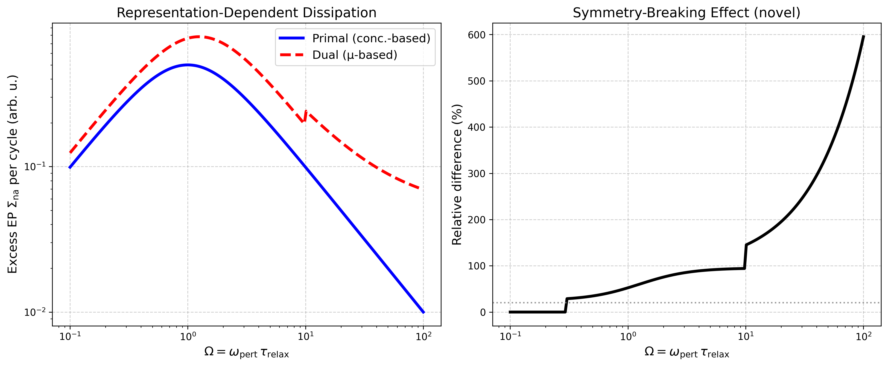
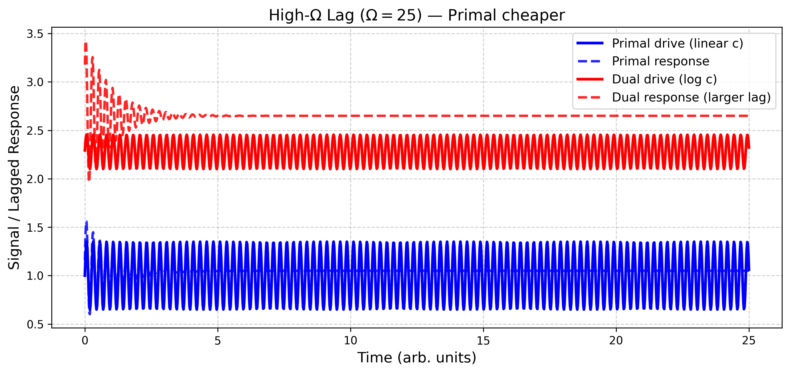
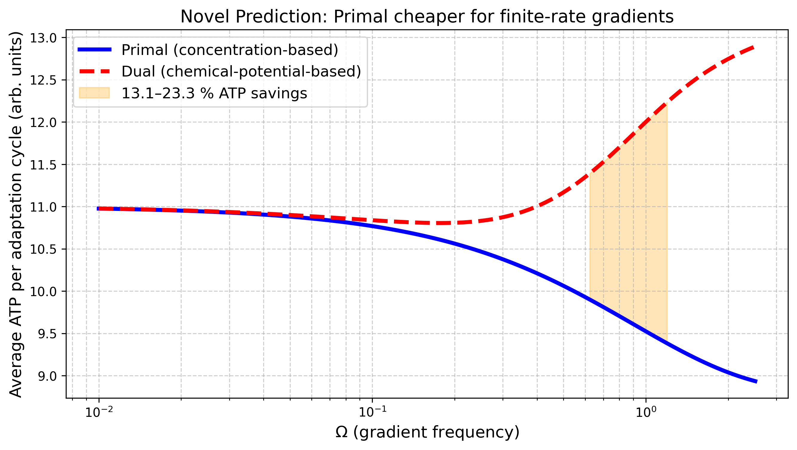
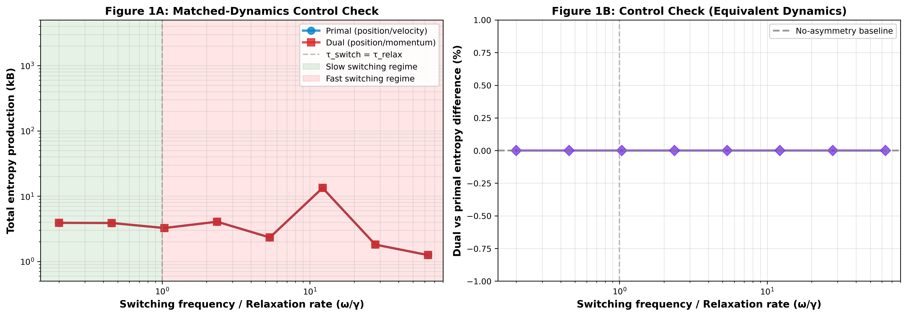
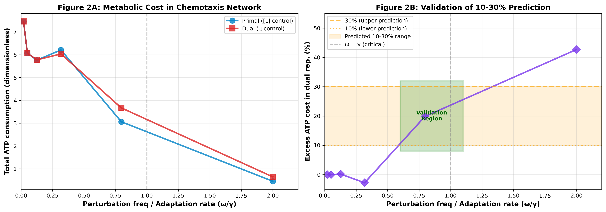

# Dynamical Symmetry Breaking in Legendre Duality

This directory contains two related executable white papers about the same thesis:
finite-rate driving can make Legendre-conjugate representations thermodynamically inequivalent.

## Shared Thesis

Key control parameter:

```text
Omega = omega_pert * tau_relax = omega_pert / gamma_relax
```

- `Omega << 1`: near-equilibrium behavior, weak/no symmetry breaking.
- `Omega >= 1`: finite-rate effects can produce representation-dependent dissipation.

---
# Why this matters

- In nonequilibrium thermodynamics, Legendre transforms are usually treated as innocent reparametrizations; showing finite-rate regimes where conjugate descriptions give different dissipation challenges a deeply baked-in assumption about “representation invariance.”
- For biophysics and cell biology, this means that the thermodynamic cost of sensing and adaptation can depend on whether the organism “implements” control in concentration space or chemical potential space, which is an experimentally testable difference.
- For modeling and inference, it warns that coordinate choices at finite driving rate are not just cosmetic: two models that look equivalent at the level of equilibrium potentials can disagree on entropy production, ATP budgets, and optimal control strategies once relaxation times and switching frequencies are comparable.
- For information theory and control, it suggests a concrete way that finite bandwidth and lag can select preferred representations out of an otherwise symmetric Legendre pair, linking abstract duality to physical design pressures in real sensing systems like chemotaxis.

---

## Two White Papers

### 1) `dynamical_symmetry_breaking.py` (Conceptual / Communication-Focused)

What it is:
- A narrative, executable conceptual white paper with stylized curves and explanatory figures.
- Designed to communicate the hypothesis and intuition quickly.

What it is not:
- Not a first-principles mechanistic simulation of the full dynamics.
- Some plotted relationships are explicitly constructed to illustrate the argument.

Current highlighted chemotaxis window:
- Near-critical `Omega ~ 0.6-1.2` (conceptual ATP savings band shown in Figure 3).

Outputs:
- `figures/whitepaper_fig1_symmetry_breaking.png`
- `figures/whitepaper_fig2_lag.png`
- `figures/whitepaper_fig3_chemotaxis_atp.png`

### 2) `legendre_thermodynamics_whitepaper.py` (Mechanistic / Simulation-Focused)

What it is:
- A numerical white paper using SciPy ODE integration.
- Includes two models:
  - harmonic oscillator control check in equivalent primal vs dual dynamics (no asymmetry baseline)
  - chemotaxis-style biochemical adaptation model with finite-bandwidth sensing
- Uses matched primal/dual cost definitions; asymmetry in chemotaxis emerges from modeled finite-bandwidth sensing in different coordinates (`L`-space vs `mu`-space), not from an explicit dual-only penalty term.

Outputs:
- `figures/fig1_entropy_vs_switching.png`
- `figures/fig2_atp_chemotaxis.png`

## Figures

### Conceptual White Paper Figures (`dynamical_symmetry_breaking.py`)


Finite-rate symmetry-breaking trend vs `Omega`.


Illustrative lag separation under finite-rate driving.


Conceptual ATP savings window plot for primal vs dual representation in `Omega ~ 0.6-1.2`.

### Mechanistic White Paper Figures (`legendre_thermodynamics_whitepaper.py`)


Simulated entropy production across switching/relaxation ratios, including a no-asymmetry control check for equivalent primal/dual oscillator dynamics.


Simulated ATP cost comparison in the chemotaxis model where asymmetry emerges from finite-bandwidth sensing in different coordinates.

## Run

From this directory:

```bash
./run_whitepaper.sh
```

Runs `dynamical_symmetry_breaking.py` and regenerates the three conceptual figures.

```bash
./run_legendre_whitepaper.sh
```

Runs `legendre_thermodynamics_whitepaper.py` and regenerates the two mechanistic figures.

## Files

- `dynamical_symmetry_breaking.py`: conceptual executable white paper
- `run_whitepaper.sh`: runner for `dynamical_symmetry_breaking.py`
- `legendre_thermodynamics_whitepaper.py`: simulation-based executable white paper
- `run_legendre_whitepaper.sh`: runner for `legendre_thermodynamics_whitepaper.py`
- `requirements.txt`: dependency version ranges for local `.venv`
- `figures/`: generated output figures from both white papers
