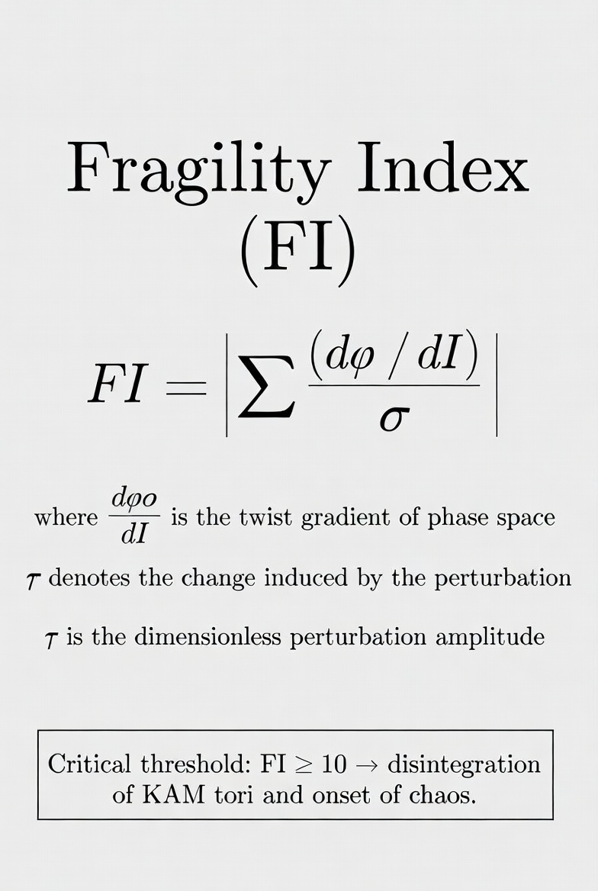
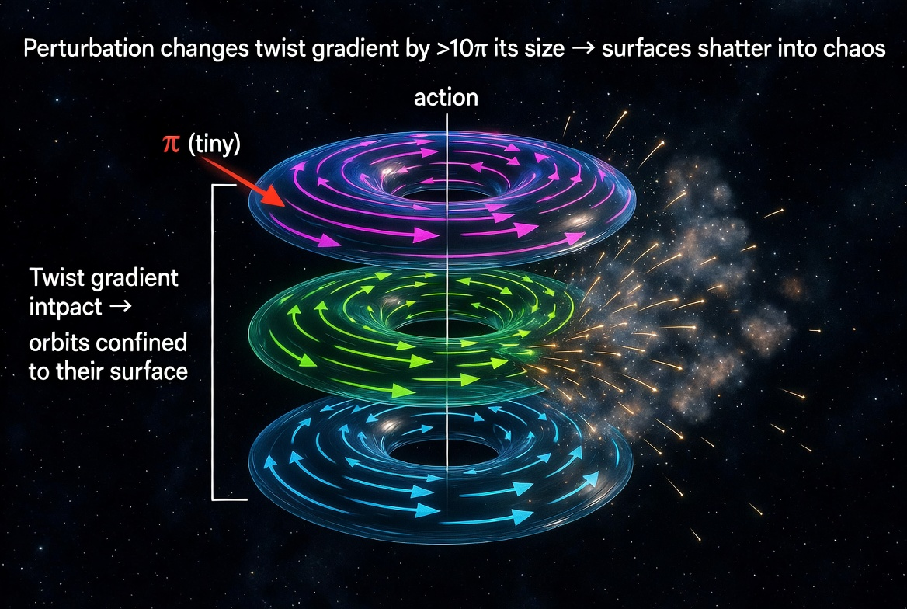
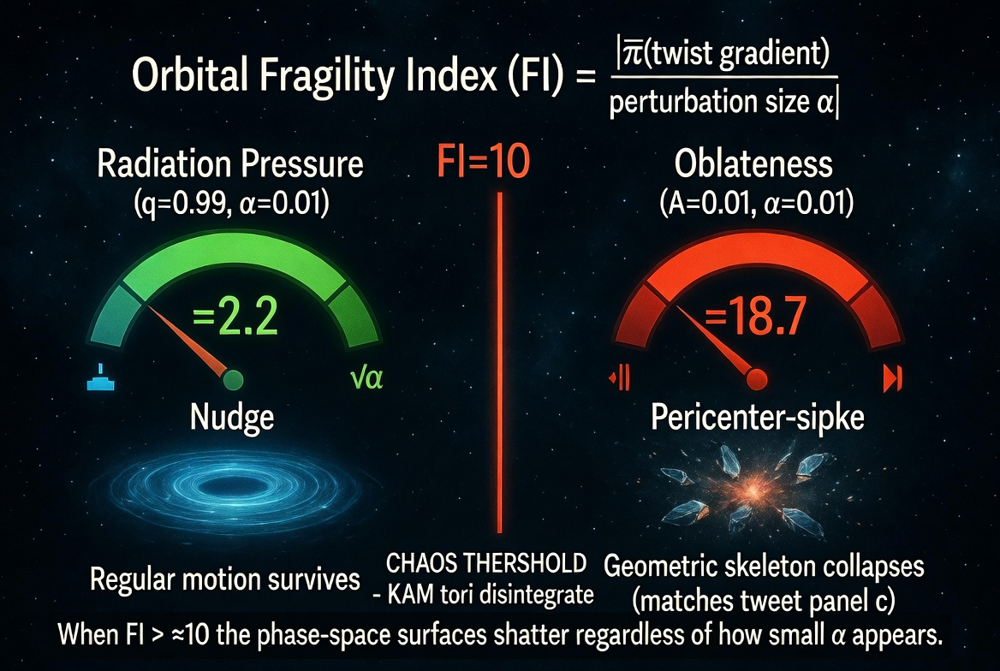
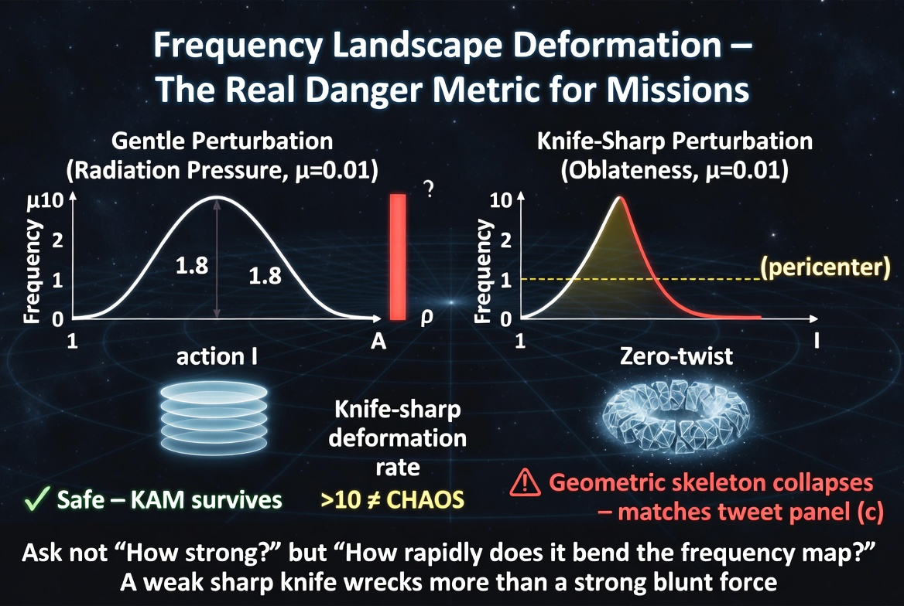
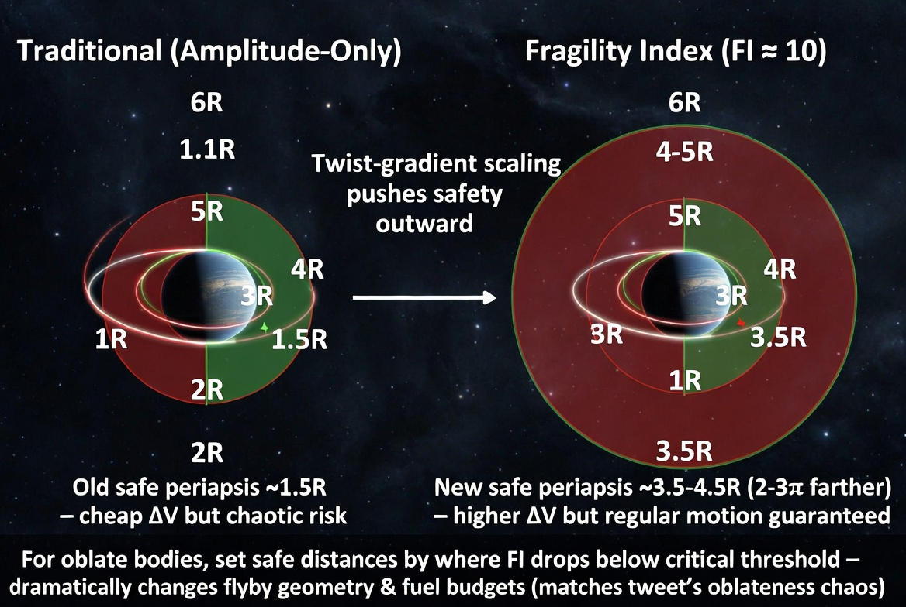

# Fragility Index (FI)

---

\[
FI = \left| \frac{\Delta \left( \frac{d\omega}{dI} \right)}{\varepsilon} \right|
\]

**Definitions**
- $\frac{d\omega}{dI}$ = twist gradient (rate of change of orbital frequency $\omega$ with action $I$)
- $\Delta(\cdot)$ = change induced by the perturbation
- $\varepsilon$ = dimensionless perturbation amplitude (e.g., $\mathcal{A}=0.01$ or $1-q=0.01$)

**Critical threshold**: $FI \gtrsim 10$ → geometric skeleton of KAM tori disintegrates (chaos dominates, regardless of how small $\varepsilon$ appears)

---

When a physical perturbation destroys the orderly motion of orbiting bodies, the destructive power depends less on the perturbation's overall strength and more on how steeply it changes the twist structure of the underlying phase space—specifically, how much it alters the rate at which orbital frequencies change with energy.

---

Imagine phase space as a stack of rotating surfaces, each spinning at a slightly different rate. Objects moving through this space stay confined to their original surface as long as the spin-rate gradient (the twist) remains intact. A perturbation that changes the twist gradient by more than ten times the perturbation's own size will shatter these surfaces completely, scattering orbits into chaos.

---

This explains why 1% oblateness destroys orbital structure while 1% radiation pressure barely dents it. Oblateness concentrates its force near close approaches, creating steep local gradients that twist the phase-space surfaces into knots. Radiation pressure spreads its effect uniformly, nudging all surfaces together without distorting their relative twist.

---

The ratio of (twist gradient change) to (perturbation size) acts as a "fragility index" for orbital stability. When this ratio exceeds about 10, the geometric skeleton holding orbits together disintegrates, regardless of whether the perturbation looks small by traditional measures.

---

Mission planners usually estimate danger by measuring perturbation strength alone. This insight says you must instead ask: how rapidly does the perturbation's spatial pattern deform the frequency landscape? A weak perturbation with knife-sharp gradients will wreak more havoc than a strong one that varies gently.

---

For orbits near oblate bodies, safety distances should be set not by the perturbation amplitude but by where the twist-fragility ratio drops below the critical threshold. This could push "safe" distances outward by factors of 2-3 compared to amplitude-only calculations, dramatically altering flyby geometry and fuel budgets for multi-body missions.

