# Green Penetration Ratio (GPR)

**A Novel Geometric Diagnostic for Choosing the Most Robust Form of Green’s Theorem Under Measurement Constraints**

**Version 1.1** • March 2026 • Open research repository

The Green Penetration Ratio turns the classic equality

∮_C (P dx + Q dy) = ∬_D (∂Q/∂x − ∂P/∂y) dA

into a **prescriptive metrological strategy tool**. It tells you — with one scalar — whether the **boundary line integral** or the **interior area integral** will deliver dramatically lower uncertainty for the same fixed sensor budget.

---

## What Is the Green Penetration Ratio?

**GPR** measures the vorticity-weighted “center of mass” distance from the boundary, normalized to the maximum possible distance inside the domain:

$$
GPR = \frac{ \iint_D |\omega(x,y)| \cdot dist(x,y)\, dA }{ \iint_D |\omega(x,y)|\, dA } \bigg/ dist_{max}
$$

where
- `dist(x,y)` = Euclidean distance to the nearest point on ∂D
- `dist_max` = maximum distance inside D (inradius for convex domains)
- ω = vorticity field

**Interpretation & Decision Thresholds**

| GPR Range     | Vorticity Location       | Recommended Strategy                  | Why It Wins                          |
|---------------|--------------------------|---------------------------------------|--------------------------------------|
| **< 0.4**     | Hugs the boundary        | Heavy boundary instrumentation        | Strong local signal, minimal 1/r decay |
| **0.4 – 0.6** | Transitional             | Weighted hybrid                       | Balanced                             |
| **> 0.6**     | Deep in interior         | Heavy interior mapping (PIV/probes)   | Interior captures huge local curl; boundary signal is weak |

---

## Visual Walkthrough – The 12 Key Figures

All plots are generated automatically by [`white_paper_clean.py`](white_paper_clean.py) and live in the [`figures/`](figures/) folder.

### Figure 1: Classic Green's Theorem – Two Mathematically Equal Views
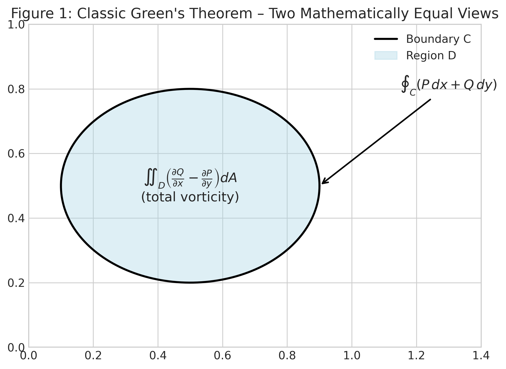

The familiar textbook picture. The left side (line integral) computes macroscopic circulation along the boundary. The right side (double integral) sums microscopic curl inside the region. **This figure shows the equality we start from** — everything that follows reveals why the two sides are *not* equally robust in practice.

### Figure 2: Distance-to-Boundary Field in the Unit Square
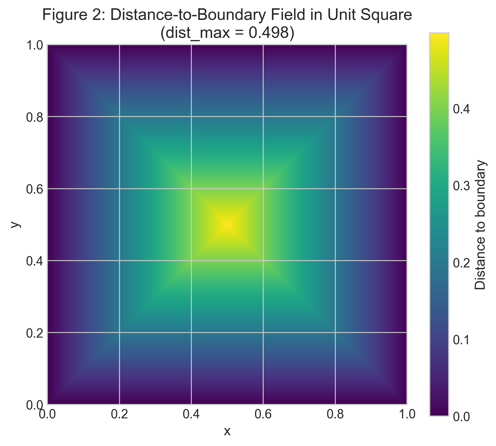

Color shows distance from any interior point to the nearest boundary (dark = near wall, bright = deep center). `dist_max ≈ 0.5`. This field is the geometric “lever arm” that turns local vorticity into boundary signal strength.

### Figure 3: Low GPR Example – Boundary-Layer Vorticity (GPR = 0.100)
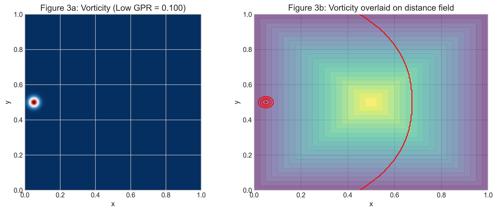

Vorticity concentrated in a thin strip against the left wall. **GPR < 0.4** → **boundary line integral is far more robust**. A few precise wall sensors capture almost everything; interior sampling would waste most points on near-zero curl.

### Figure 4: High GPR Example – Centered Free Vortex (GPR = 0.819)
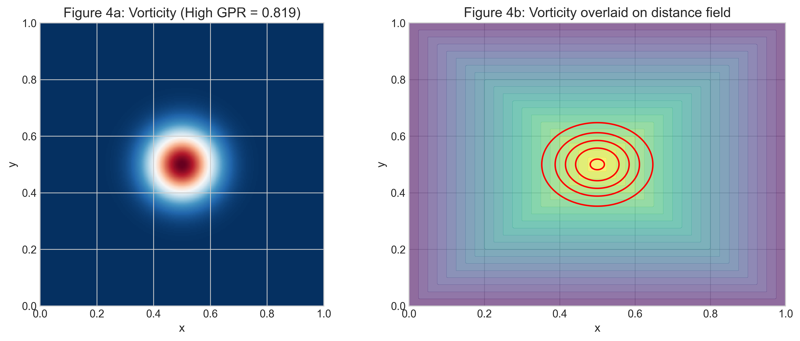

Vorticity lives deep in the center. **GPR > 0.6** → **interior area integral wins**. The boundary sees only a weak 1/r tail; interior probes placed near the core recover the total circulation with excellent signal-to-noise.

### Figure 5: Velocity Magnitude Induced by Centered Vortex
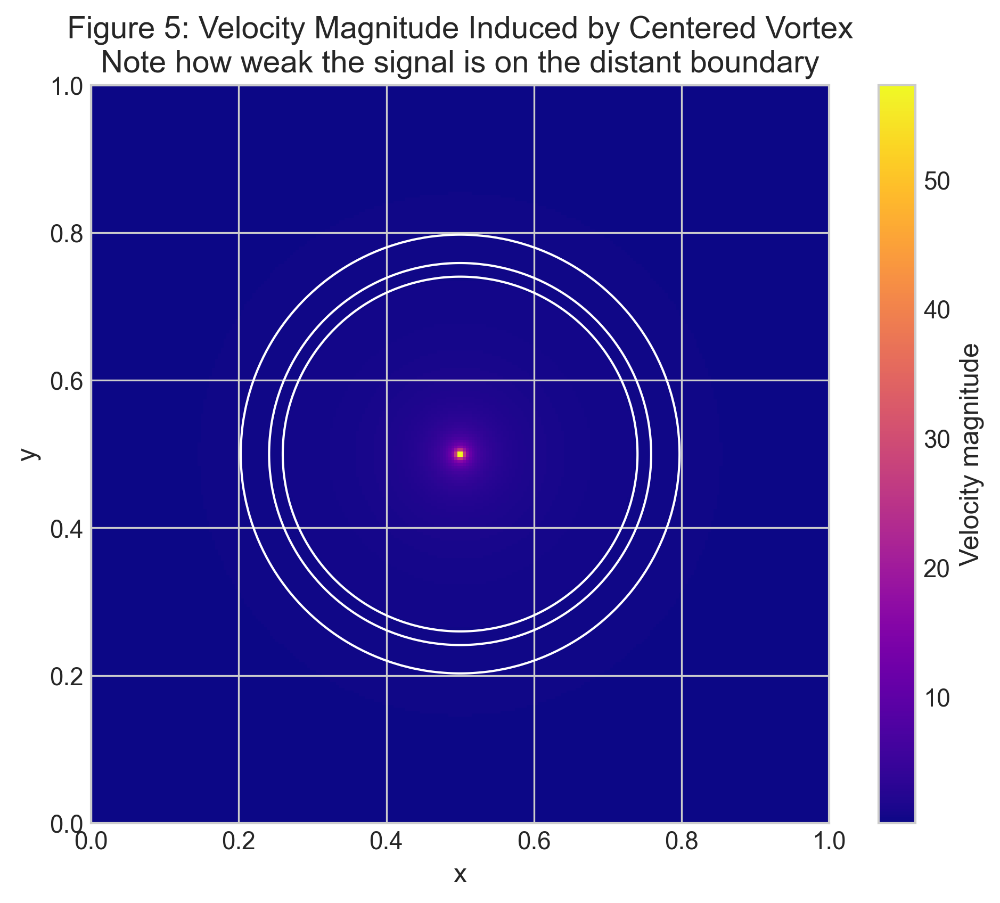

Same centered vortex. Note how the velocity on the distant boundary is extremely weak (dark blue). This visualizes the **geometric leverage** that makes boundary measurements fragile when GPR is high.

### Figure 6: Monte-Carlo Error vs. GPR (500 realizations, fixed 200-sample budget)
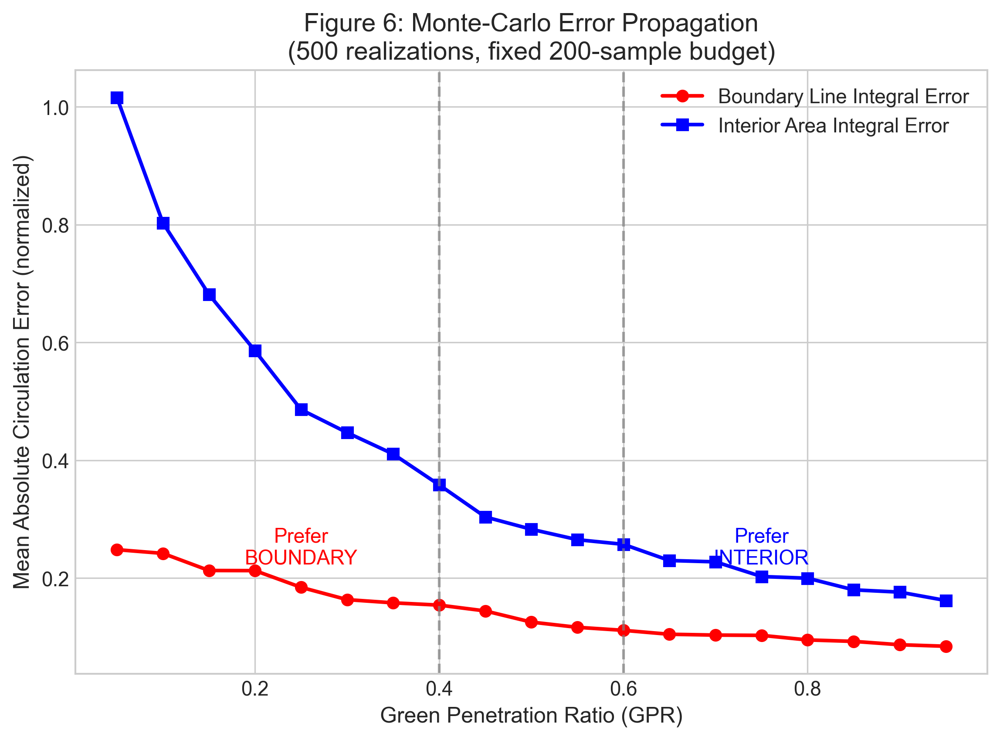

**The smoking-gun result.** With identical noise and budget, boundary error explodes as GPR rises (red), while interior error drops (blue). Crossover occurs exactly at the 0.4 / 0.6 thresholds — confirming the diagnostic is quantitatively predictive.

### Figure 7: Recommended Sensor Allocation for Fixed Budget of 200 Sensors
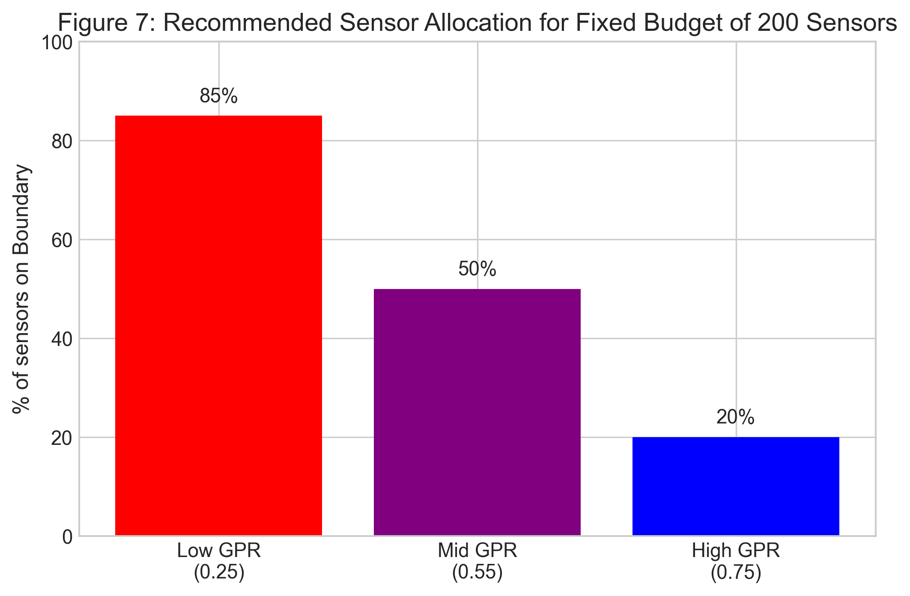

Direct practical rule. At low GPR → 85 % of sensors on the boundary. At high GPR → only 20 % on the boundary (the rest go deep inside). This chart is the one you show your lab manager before ordering hardware.

### Figure 8: Industry Sectors Where GPR Delivers Immediate ROI
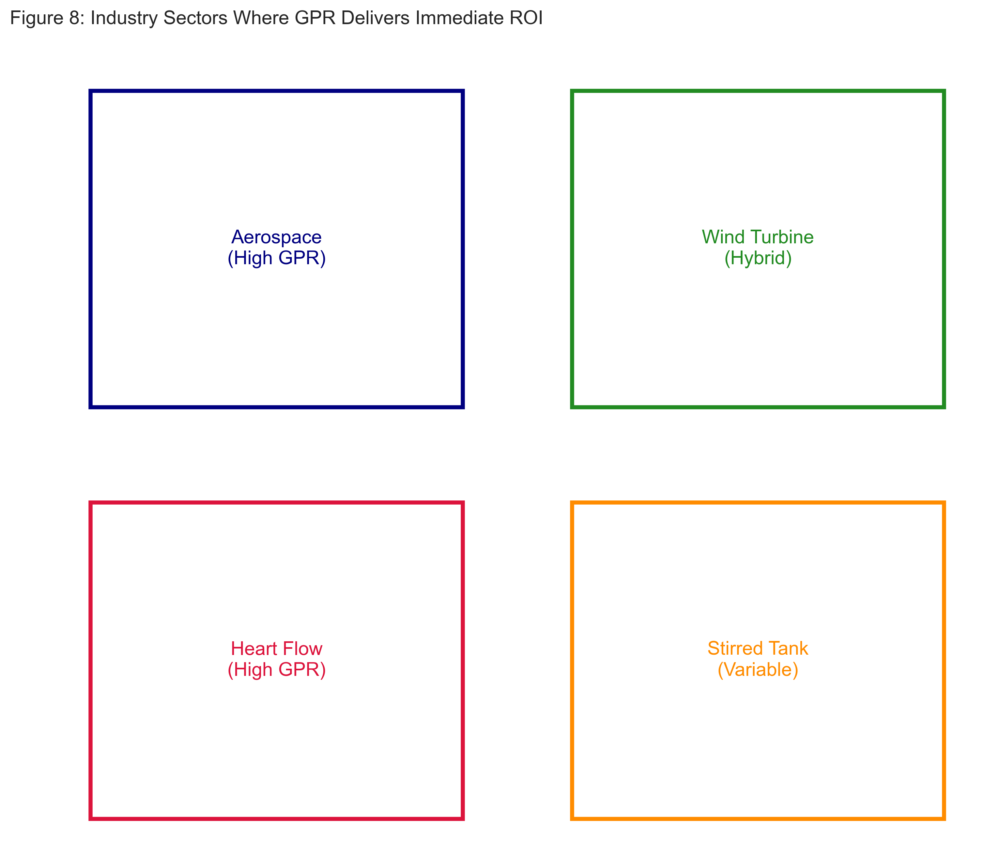

Visual summary of the high-impact domains (aerospace, wind energy, cardiac flow, mixing tanks). See [`INDUSTRY.md`](INDUSTRY.md) for full quantitative ROI estimates.

### Figure 9: Error Surface – Boundary Line Integral (illustrative)
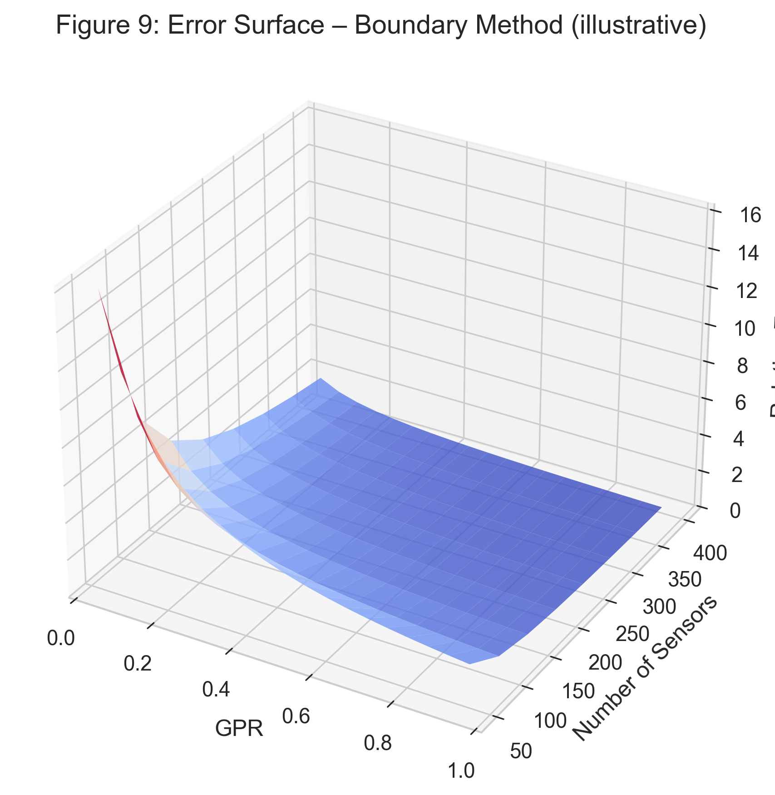

3-D view showing how boundary-method uncertainty grows with GPR and shrinks with more sensors. Use this when building uncertainty budgets.

### Figure 10: Error Surface – Interior Area Integral (illustrative)
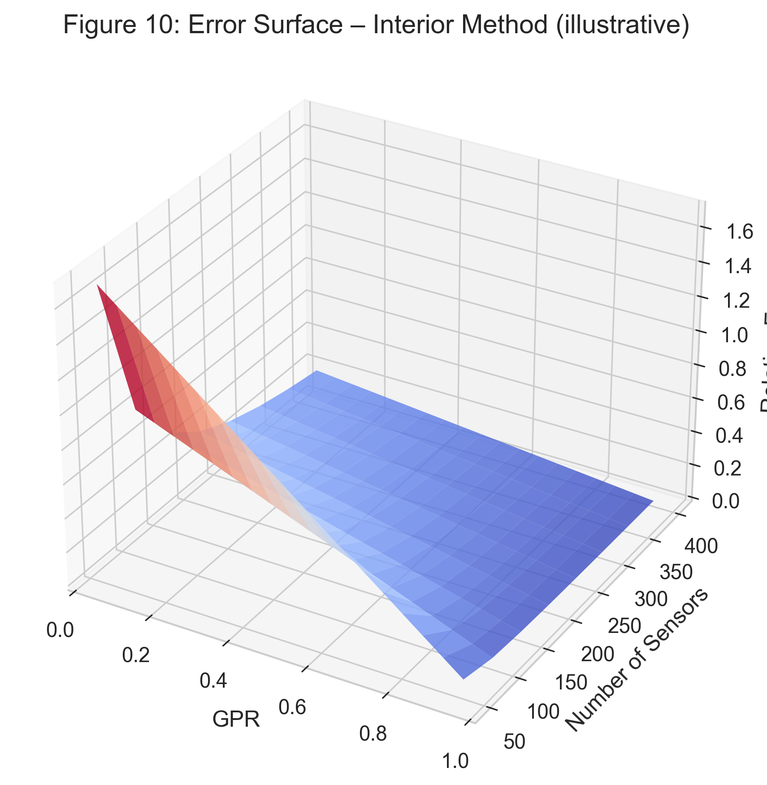

Complementary surface for the area method. Together, Figures 9–10 make the asymmetry visually obvious.

### Figure 11: Convergence Rates (High-GPR case = 0.75)
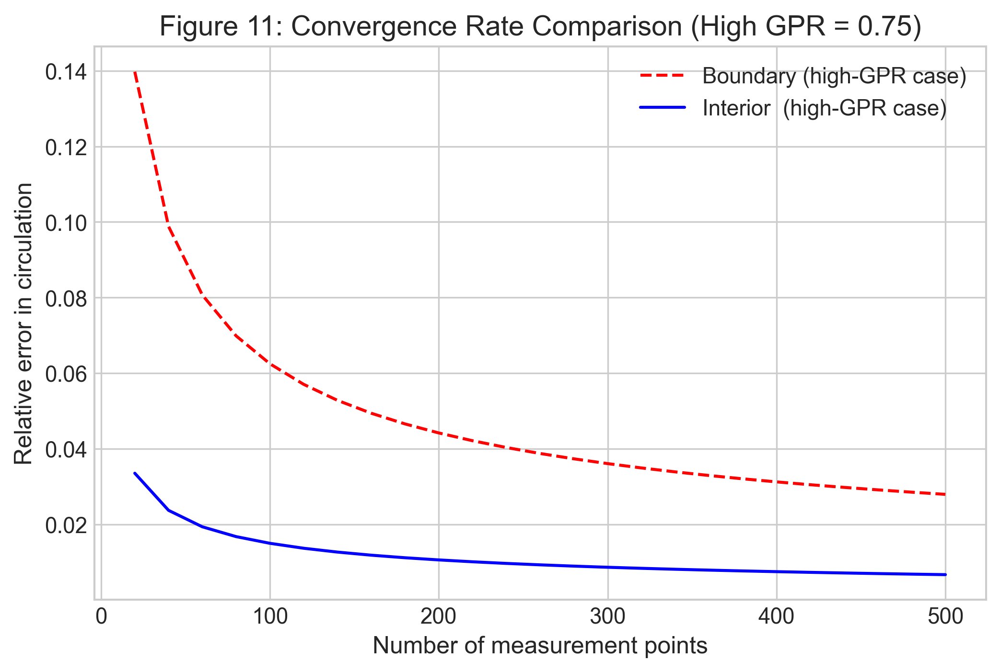

Even with increasing sample count, the boundary method converges much more slowly when vorticity is deep inside. Interior method reaches target accuracy with far fewer points.

### Figure 12: Decision Flowchart for GPR-Guided Measurement Strategy


One-page summary you can print and tape above your workstation. Compute GPR → read off the optimal strategy.

---

## How to Use GPR in Your Own Work

```python
from green_penetration_ratio import compute_gpr  # (included in code/)

gpr_value = compute_gpr(omega_field, domain_mask)
if gpr_value < 0.4:
    # → allocate 80+% sensors to boundary
elif gpr_value > 0.6:
    # → allocate 80+% sensors to interior
else:
    # → weighted hybrid
```
