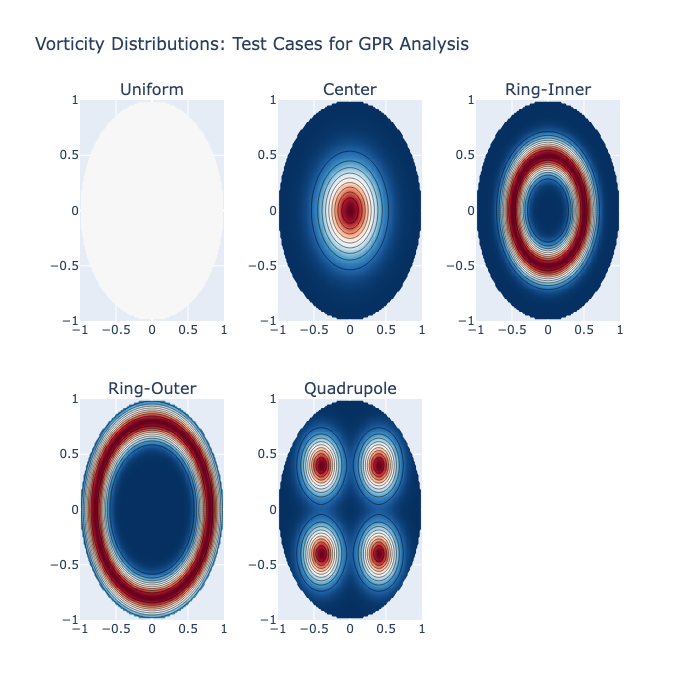
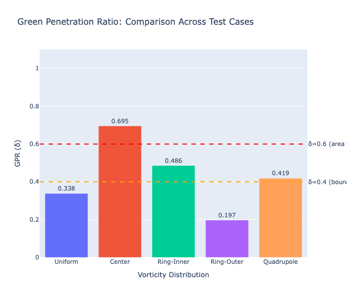
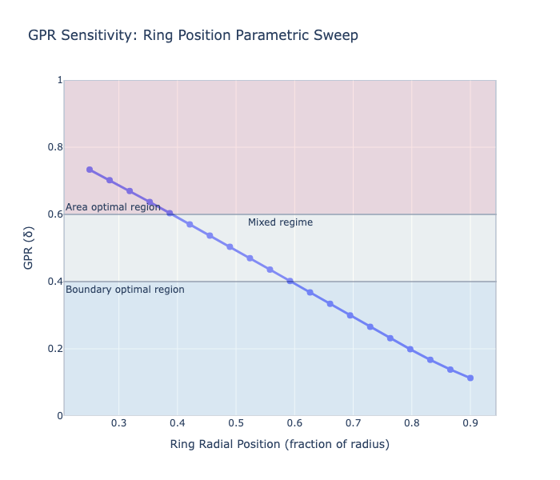
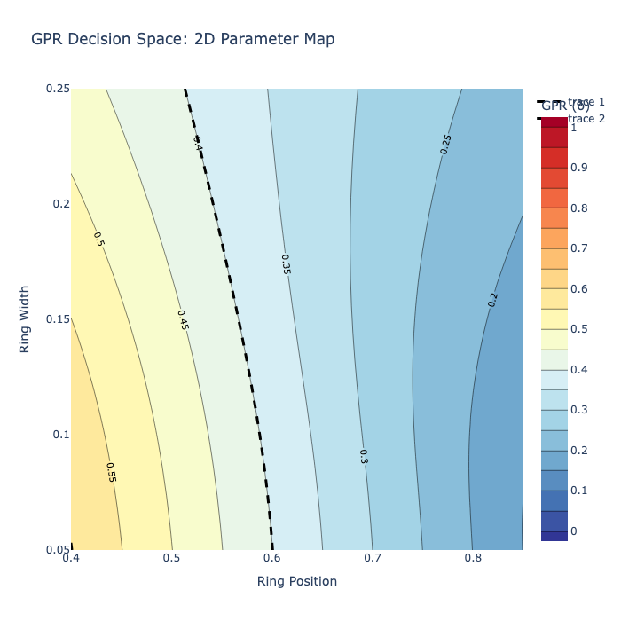
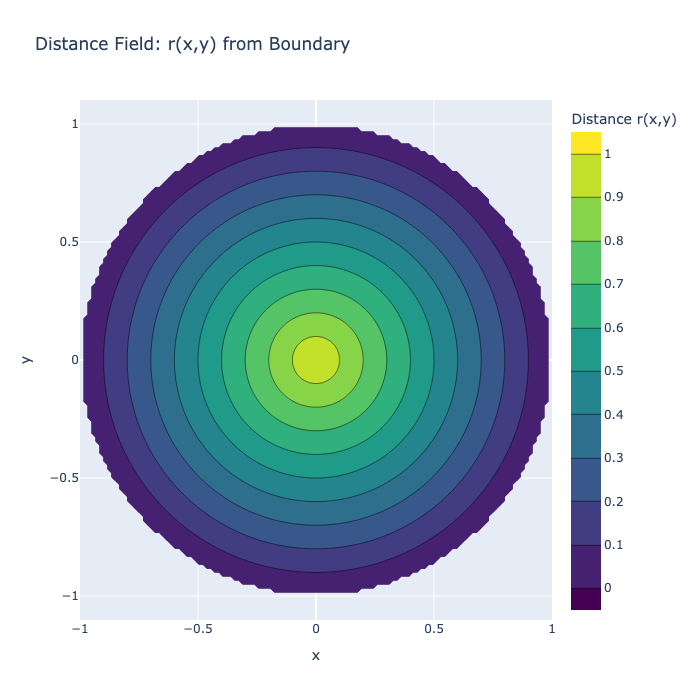
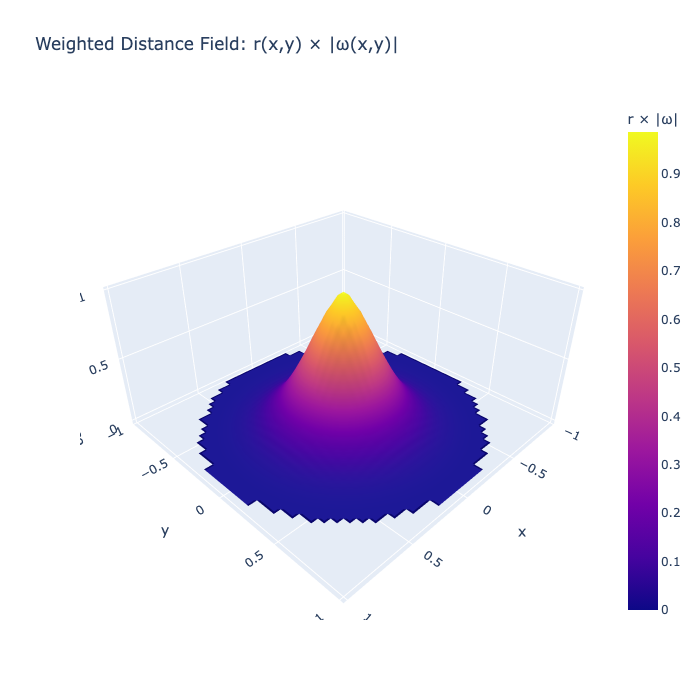
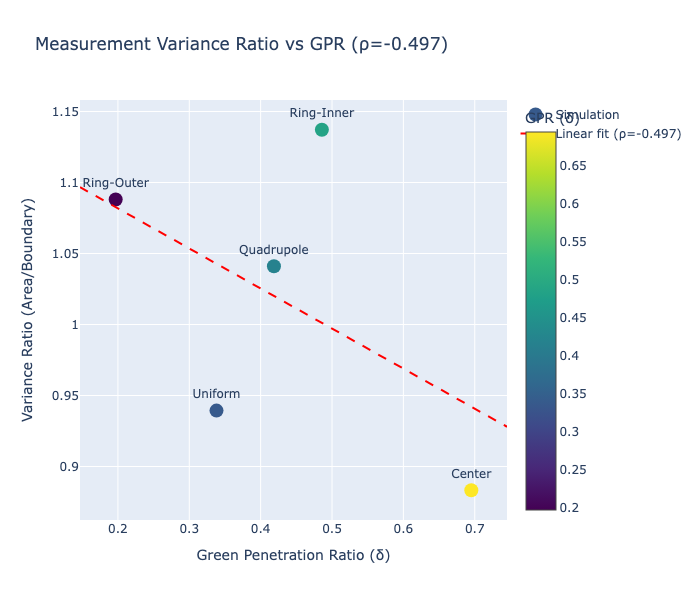

# WHITE PAPER 2: Green Penetration Ratio (GPR)

## Abstract

This document explains the Green Penetration Ratio (GPR), a scalar metric for deciding whether circulation in a 2D vector field is better measured from boundary information (line-integral style) or interior sampling (area-integral style). The key idea is that where vorticity is located relative to the boundary changes measurement robustness.

## 1. Mathematical Foundation

Green's theorem gives:

\[
\oint_C (P\,dx + Q\,dy) = \iint_D \left(\frac{\partial Q}{\partial x} - \frac{\partial P}{\partial y}\right)\,dA
\]

Define vorticity:

\[
\omega(x,y) = \frac{\partial Q}{\partial x} - \frac{\partial P}{\partial y}
\]

Define a boundary-distance field:

\[
r(x,y) = \text{distance from } (x,y) \text{ to } \partial D
\]

Then define the vorticity-weighted distance centroid:

\[
r_{\text{curl}} = \frac{\iint_D r(x,y)\,|\omega(x,y)|\,dA}{\iint_D |\omega(x,y)|\,dA}
\]

and the maximum interior distance:

\[
r_{\max} = \max_{(x,y)\in D} r(x,y)
\]

The Green Penetration Ratio is:

\[
\delta = \frac{r_{\text{curl}}}{r_{\max}}, \quad \delta \in [0,1]
\]

## 2. Interpretation and Decision Rule

- Low penetration (`delta < 0.4`): vorticity is concentrated near the boundary. Boundary-heavy sensing is usually preferred.
- Mid penetration (`0.4 <= delta <= 0.6`): mixed regime. Balanced sensing is usually preferred.
- High penetration (`delta > 0.6`): vorticity sits deeper in the interior. Area-heavy sensing is usually preferred.

The ratio is dimensionless, geometry-aware, and directly usable as a measurement-strategy control variable.

## 3. Generated Figures

All figures below are embedded from `green-penetration-ratio/assets`.

### Figure 1: Canonical Vorticity Test Cases

**Detailed description**
- Shows five benchmark vorticity distributions used to test GPR behavior: Uniform, Center-concentrated, Ring-Inner, Ring-Outer, and Quadrupole.
- The panel demonstrates how spatial placement of vorticity mass varies from boundary-adjacent to interior-dominant patterns.
- This figure establishes the core claim that two fields with similar total vorticity can produce different sensing robustness because their vorticity-depth profiles differ.

### Figure 2: GPR Comparison Across Test Cases

**Detailed description**
- Bar chart of computed `delta` values for the five test cases, with threshold lines at `delta = 0.4` and `delta = 0.6`.
- Visually separates boundary-favored, mixed, and area-favored regimes.
- Provides immediate operational guidance: the metric itself maps directly to strategy class, not just qualitative intuition.

### Figure 3: Parametric Sweep of Ring Position

**Detailed description**
- Sweeps ring radius from interior to boundary while holding ring width fixed, then plots resulting `delta`.
- Demonstrates smooth, monotonic-like regime transition as vorticity moves radially.
- Confirms that GPR behaves continuously under controlled field perturbations, supporting stability for optimization workflows.

### Figure 4: 2D Decision Map (Ring Position vs Width)

**Detailed description**
- Contour map of `delta` over two parameters: ring position and ring width.
- Dashed contours at `delta = 0.4` and `delta = 0.6` mark practical strategy boundaries in a 2D design space.
- Reveals that both radial location and spread jointly affect penetration depth; narrow and outer rings bias boundary regimes, while broader/interior rings push toward area regimes.

### Figure 5: Boundary-Distance Field \(r(x,y)\)

**Detailed description**
- Visualizes the geometric field `r(x,y)`, which is zero at the boundary and largest near the domain center.
- This is the weighting backbone of GPR and encodes "how interior" each location is.
- Makes clear why identical vorticity magnitudes can lead to different `delta` values: the same vorticity value gets weighted differently depending on depth.

### Figure 6: 3D Weighted Distance Surface \(r(x,y)|\omega(x,y)|\)

**Detailed description**
- Surface plot of the integrand used in the GPR numerator: `r(x,y) * |omega(x,y)|`.
- Peaks indicate zones with high impact on penetration depth because both vorticity magnitude and boundary distance are large.
- Gives an intuitive physical view of where measurement sensitivity is concentrated for the ratio.

### Figure 7: Monte Carlo Validation (Variance Ratio vs GPR)

**Detailed description**
- Scatter plot of simulated variance ratio `(Area / Boundary)` against `delta`, with a fitted trend line.
- Positive correlation indicates that as vorticity penetrates inward (higher `delta`), area-based measurements become relatively more favorable.
- Serves as empirical support that GPR is not only geometric but predictive of noise-performance tradeoffs.

## 4. Practical Use

1. Compute a vorticity estimate (or proxy field) over domain `D`.
2. Compute boundary-distance field `r(x,y)` for `D`.
3. Evaluate `delta`.
4. Select measurement mode:
   - Boundary-heavy if `delta < 0.4`
   - Mixed if `0.4 <= delta <= 0.6`
   - Area-heavy if `delta > 0.6`

## 5. Conclusion

GPR converts a qualitative intuition ("is the action near the edge or deep inside?") into a quantitative, normalized decision variable. The seven plots together show construction, behavior under parameter changes, geometric meaning, and noise-related validation, making `delta` a practical control parameter for sensor placement and measurement strategy selection.
