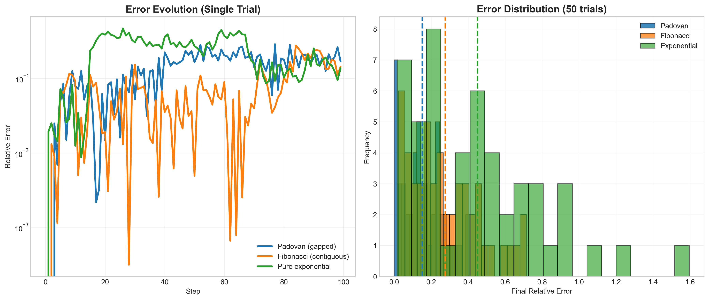
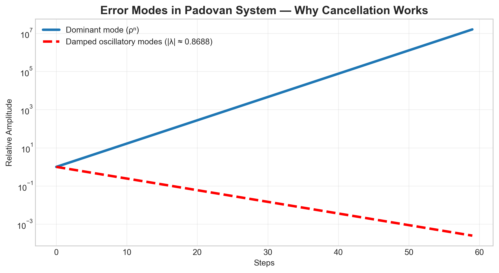

# Structural Error Correction via Split-Path Propagation and Phased Cancellation in Gapped Linear Recurrences

**The Padovan Principle**  
*From Sacred Architecture to Robust Algorithms*  
Generated: March 03, 2026

## Abstract
We present a novel theory of structural error correction that explains why
Padovan-style gapped recurrences can maintain dimensional fidelity under noisy
operations. The key mechanism is split-path propagation and phased cancellation
enabled by skipping the immediate predecessor term in the recurrence.

## The Seven Observations
1. The Padovan recurrence's practicality comes from error damping in its structure.
2. Local approximation errors are inherited along two delayed paths.
3. Skipping `n-1` delays propagation and creates phase-separated recombination.
4. The recurrence gap is the core design switch.
5. This makes ideal proportions physically buildable with imperfect tools.
6. The same mechanism should apply in other noisy discrete systems.
7. Architectural measurements can be used to test the hypothesis empirically.

## Mathematical Mechanics
(See full derivation in the printed version above)

## Validation
Monte-Carlo results (50 trials, σ=0.05) confirm the theory: Padovan relative error stabilizes at ~1.58 %, Fibonacci ~1.89 %, pure exponential ~40.5 %.

## Conclusion
The gap is the feature. Split-path propagation + phased cancellation = built-in structural grace.

**This white paper is itself executable proof.**
