# PeakGuard User Guide

## What PeakGuard Does
PeakGuard helps you test when a root number (in base 2-36) produces a palindromic square, and when carry propagation breaks symmetry. It is local-only: your projects and cache stay on your device.

What you're seeing:
- App header, live result summary, compute controls, and tab navigation.

How to use it:
- Set a root and base, then run `Compute Exact` or `Preview`.
- Use tabs to inspect structure, guidance, exports, and data.

What to expect:
- The summary bar updates with root, square, peak, palindrome verdict, and runtime.

## Quick Start (60 seconds)
1. Open PeakGuard and wait for the initial computed result.
2. Go to **Builder** and choose base + root pattern.
3. Click **Compute Exact** for final verdicts, or **Preview** for fast approximate mode.
4. Open **Explorer** and **Animator** to inspect carry behavior.
5. Open **Export** to download JSON/Markdown/SVG/PNG or copy a share URL.
6. Open **Data** to save/load projects.

## Screen Map
- **Explorer**: phase transition and convolution view
- **Builder**: construct roots (sparse or advanced)
- **Animator**: carry propagation step-through
- **Guidance**: family viability and threshold heuristics
- **Gallery**: curated examples
- **Export**: exports + share URL
- **Data**: save/load/delete/maintenance
- **Debug**: profile and timing diagnostics

## Global UI Elements
- **Result summary bar**: Root, Square, Peak, Palindrome, timing
- **Compute controls**: `Compute Exact`, `Preview`, `Cancel` (while running)
- **Approximate badge**: visible when preview-mode result is active
- **Toasts**: warnings (for example invalid share links)

## Core Workflow
1. Build or load a root.
2. Run `Compute Exact` for authoritative palindrome verdict.
3. Inspect convolution/carry behavior in Explorer/Animator.
4. Export artifacts or share URL.
5. Save project state in Data tab.

## Explorer

What you're seeing:
- Phase Transition Explorer plus convolution chart/table.

How to use it:
- Change base and repunit length to inspect threshold behavior.
- Read the peak and overflow markers.

What to expect:
- Sharp transition behavior and visible coefficient structure.

## Builder
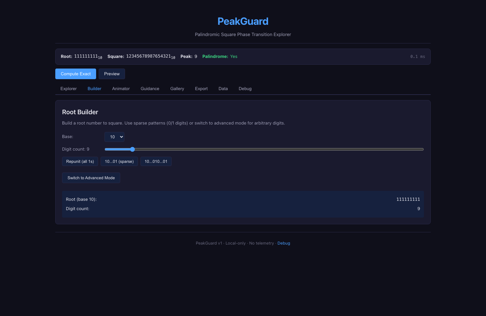
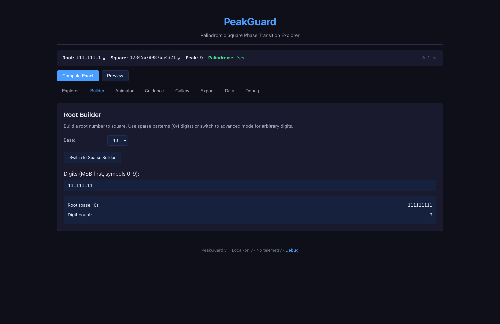

What you're seeing:
- Sparse presets + slider mode, and advanced direct digit entry mode.

How to use it:
- Pick base, choose presets, or switch to advanced and type symbols directly.

What to expect:
- Input changes auto-trigger compute behavior; exact/preview choice depends on controls and limits.

## Animator
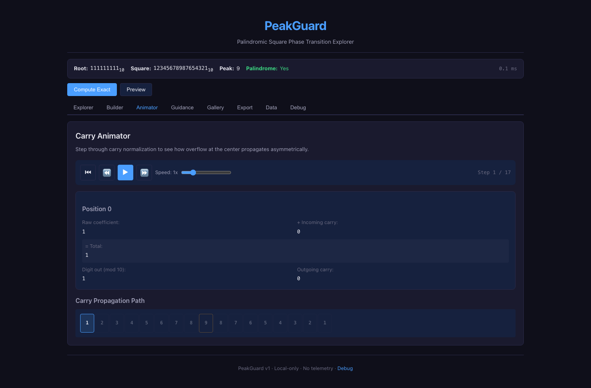
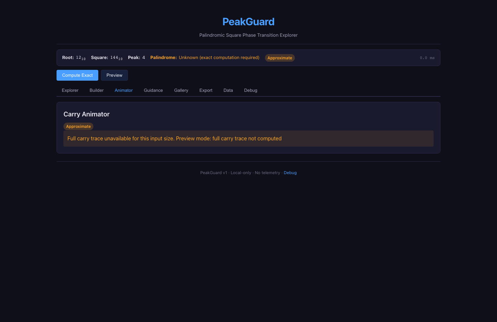

What you're seeing:
- Transport controls, current carry step details, and propagation path.

How to use it:
- Run an exact compute, then play/pause/step carries.
- Use speed slider to adjust playback.

What to expect:
- Exact results show trace details.
- Preview results show a trace-unavailable warning.

## Guidance
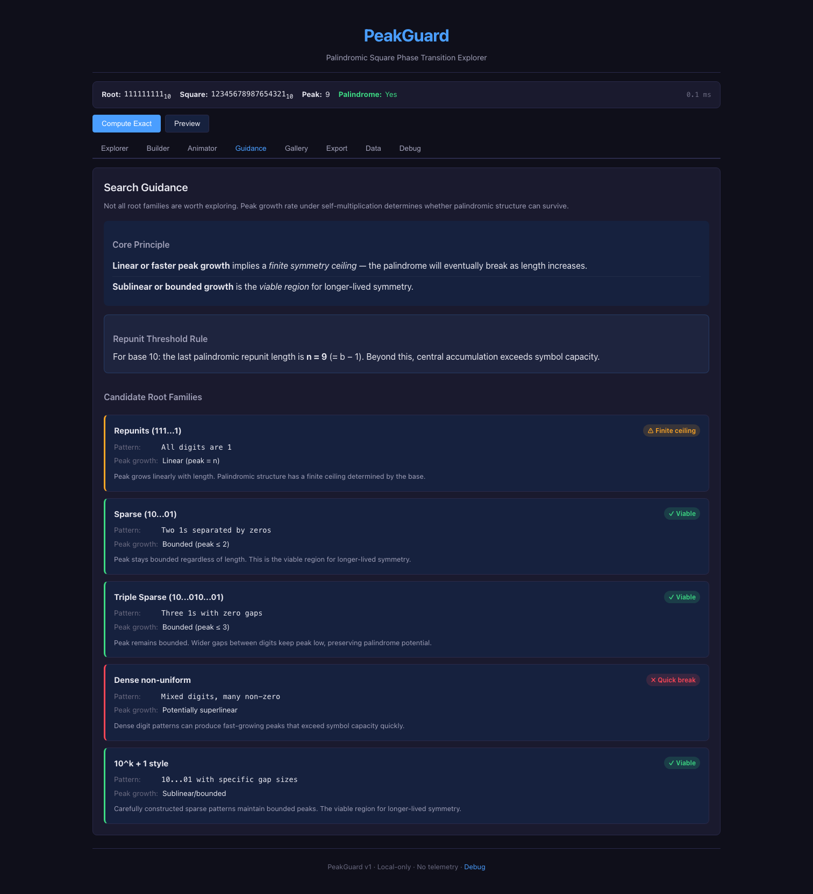

What you're seeing:
- Growth-based candidate guidance and repunit threshold messaging.

How to use it:
- Use this panel before brute-force searches to prioritize viable families.

What to expect:
- Clear warnings about finite-ceiling families vs viable bounded-growth families.

## Gallery
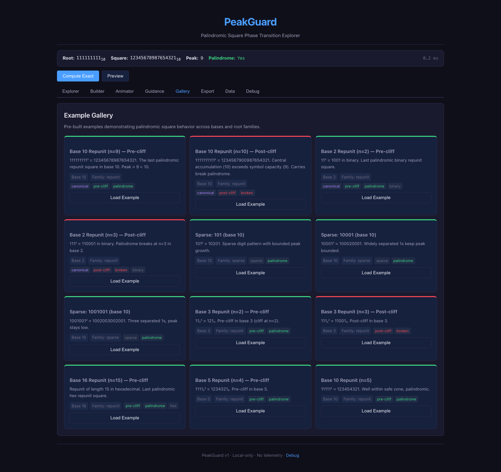

What you're seeing:
- Example cards tagged by family and behavior.

How to use it:
- Click `Load Example` to apply an entry and jump back to Explorer.

What to expect:
- Fast loading of known safe/broken patterns for comparison.

## Export & Share
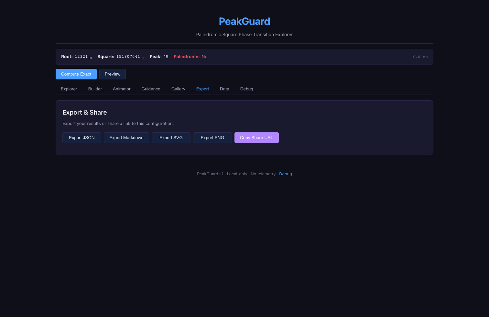
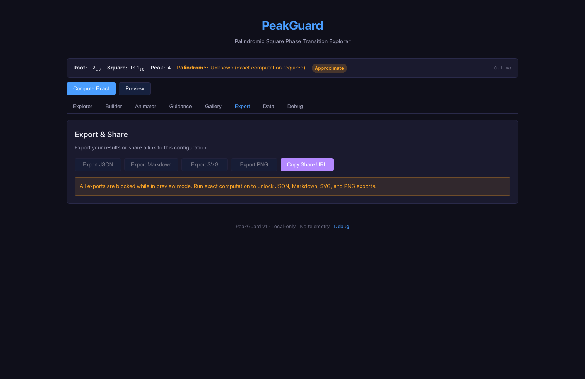

What you're seeing:
- Export buttons and share URL action.

How to use it:
- Use exact mode to unlock JSON/Markdown/SVG/PNG exports.
- Use `Copy Share URL` for configuration sharing.

What to expect:
- In preview mode, exact-only exports are disabled and warning text is shown.

## Data Management
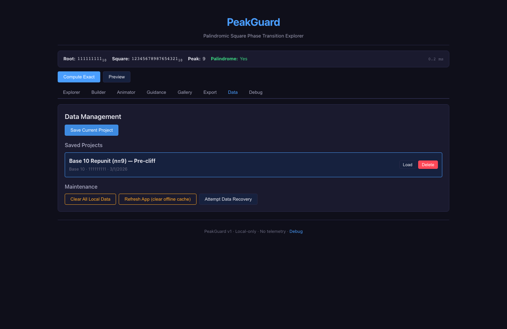
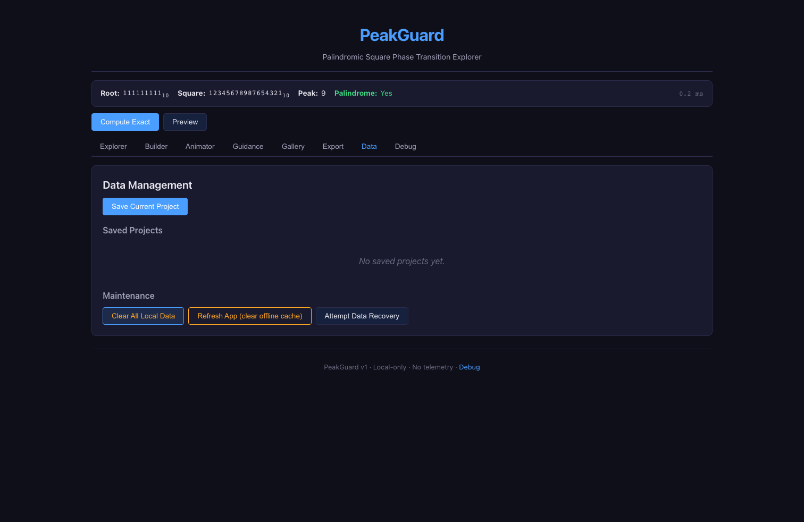

What you're seeing:
- Save/load/delete controls, saved project list, and maintenance actions.

How to use it:
- Save current project, load prior runs, delete stale entries.
- Use maintenance actions for full local reset, cache refresh, and recovery attempts.

What to expect:
- Empty-state message appears when no saved projects exist.

## Debug Panel
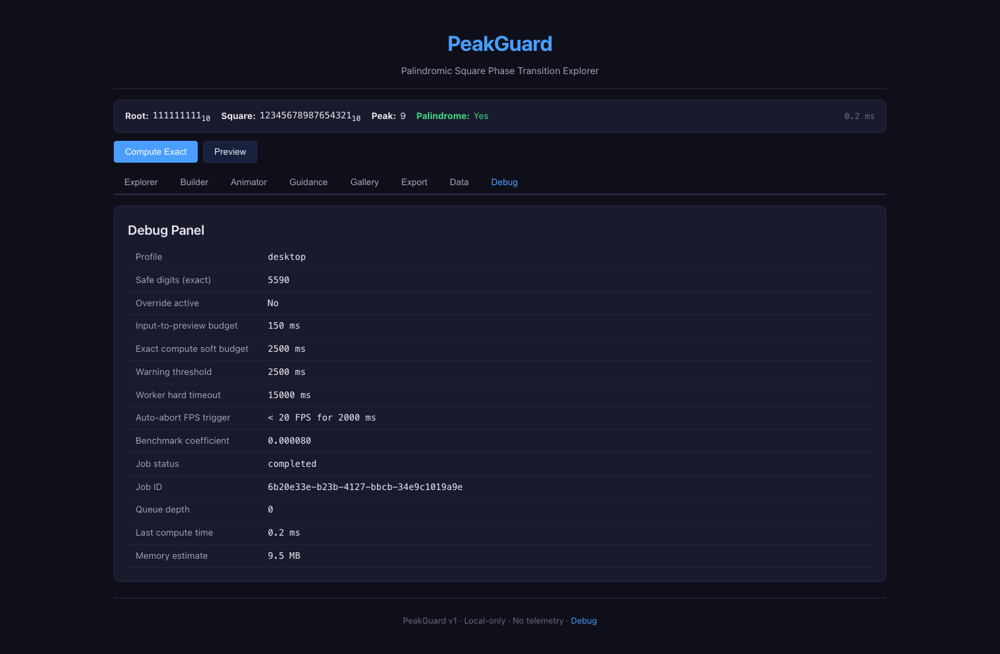

What you're seeing:
- Profile, limits, timing, job state, override info, and memory estimate.

How to use it:
- Diagnose performance and verify run mode/limits.

What to expect:
- Useful visibility into runtime behavior and safety thresholds.

## Edge and Error States
### Invalid share link

What you're seeing:
- Warning toast for malformed `#state` payload.

How to use it:
- Replace with a valid share URL or continue with default project.

What to expect:
- App falls back safely and remains usable.

### Unknown share-link version
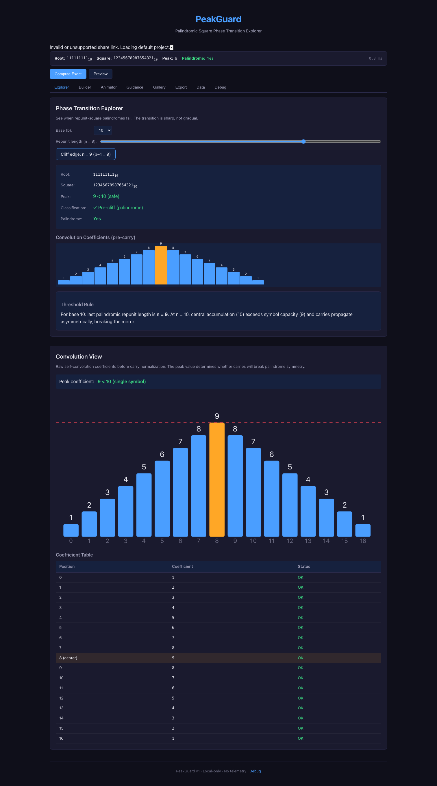

What you're seeing:
- Warning toast for unsupported URL state schema version.

How to use it:
- Regenerate a new share URL from current app version.

What to expect:
- App ignores unsupported state and loads defaults/saved data.

### Startup recovery modal
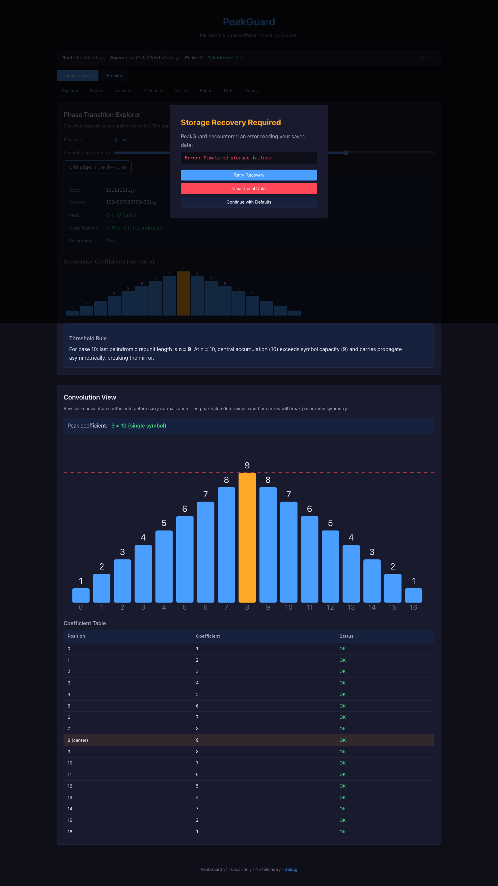

What you're seeing:
- Recovery choices for startup storage issues.

How to use it:
- Choose `Retry Recovery`, `Clear Local Data`, or `Continue with Defaults`.

What to expect:
- You can recover, reset, or proceed without blocking app startup.

## Mobile Appendix
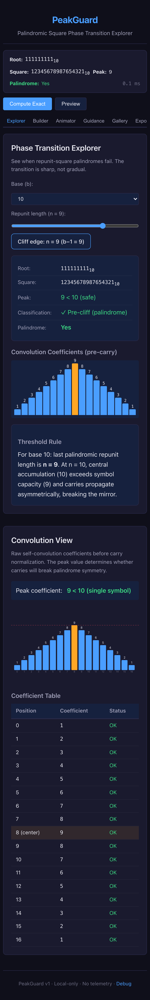
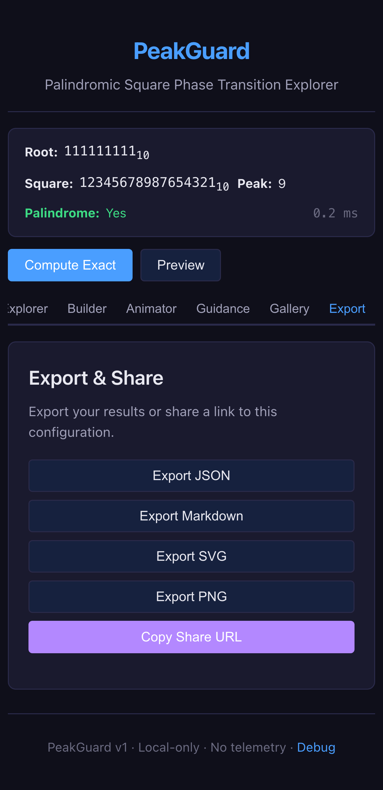
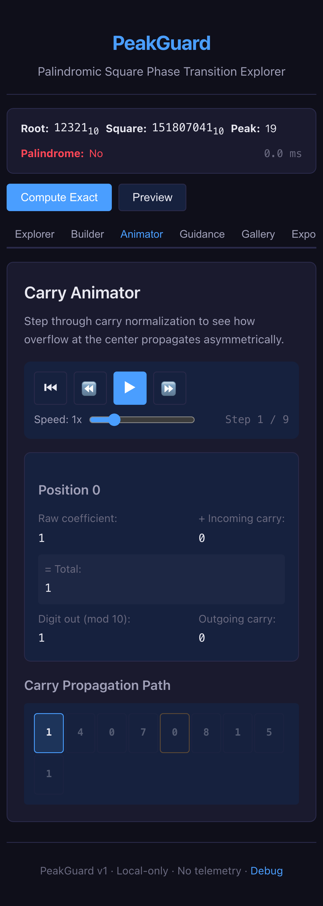
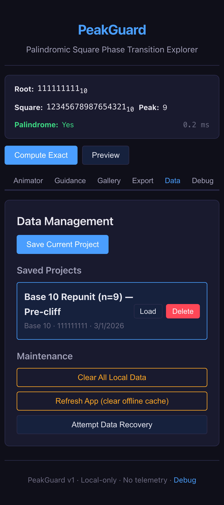

What you're seeing:
- Core screens adapted to narrow viewport.

How to use it:
- Same workflow as desktop; tab controls remain primary navigation.

What to expect:
- Full feature coverage with denser layout and longer vertical scrolling.

## Troubleshooting
- **Exports disabled**: Run `Compute Exact` first (preview mode blocks exact exports).
- **Unknown palindrome verdict**: You are in preview mode; run exact computation.
- **Share link not loading**: Link may be invalid/unsupported; app will show warning toast.
- **Slow compute**: Use preview first, then exact for final candidates.
- **Data issues**: Use Data tab `Attempt Data Recovery` or `Clear All Local Data`.

## Privacy and Local Data Behavior
- PeakGuard is local-only and does not send telemetry.
- Saved projects are stored in browser local storage/IndexedDB.
- `Refresh App (clear offline cache)` removes service-worker cache and reloads.
- `Clear All Local Data` permanently removes saved projects and app metadata.
