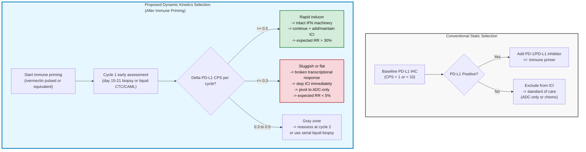

# Dynamic PD-L1 Kinetics After Immune Priming: Inverting Patient Selection for Checkpoint Inhibitors in PD-L1-Negative Metastatic Triple-Negative Breast Cancer

## Abstract

Current clinical practice excludes patients with PD-L1-negative metastatic triple-negative breast cancer from checkpoint inhibitor therapy based on the absence of target expression. This white paper challenges that exclusion criterion by proposing that baseline PD-L1 negativity, when combined with rapid PD-L1 inducibility following immune priming, identifies an optimal patient population for combination immunotherapy strategies. Drawing on emerging data from the NCT05318469 Phase I/II trial combining ivermectin with balstilimab in metastatic triple-negative breast cancer, we argue that the velocity of PD-L1 upregulation during early treatment cycles predicts checkpoint inhibitor benefit more accurately than either static baseline expression or absolute post-treatment levels. This insight inverts conventional patient selection logic and suggests that dynamic biomarker assessment after one treatment cycle should replace static baseline exclusion criteria. We propose specific thresholds for PD-L1 induction rates that stratify responders from non-responders and outline immediate clinical implications for adaptive treatment decisions and protocol optimization.

***

## Introduction

### The Triple-Negative Breast Cancer Challenge

Triple-negative breast cancer represents approximately fifteen percent of all breast cancer diagnoses but accounts for a disproportionate share of breast cancer mortality. Defined by the absence of estrogen receptor, progesterone receptor, and HER2 amplification, TNBC lacks the molecular targets that have revolutionized treatment for other breast cancer subtypes. When TNBC metastasizes, median overall survival remains below eighteen months with conventional chemotherapy, creating an urgent need for novel therapeutic approaches.

Checkpoint inhibitor immunotherapy targeting the PD-1/PD-L1 axis has transformed outcomes across multiple cancer types, including melanoma, lung cancer, and renal cell carcinoma. In breast cancer, however, the results have been more modest. The IMpassion130 trial demonstrated that adding the PD-L1 inhibitor atezolizumab to nab-paclitaxel improved progression-free survival in previously untreated metastatic TNBC, but only in the subset of patients whose tumors expressed PD-L1 at baseline. The objective response rate in PD-L1-positive patients reached fifty-six percent with the combination versus forty-six percent with chemotherapy alone. Critically, patients with PD-L1-negative tumors, comprising approximately sixty percent of the metastatic TNBC population, derived no apparent benefit from checkpoint inhibition.

This observation solidified a clinical paradigm: PD-L1 expression became a patient selection biomarker, with PD-L1-negative patients routinely excluded from checkpoint inhibitor trials and clinical use. The logic appeared straightforward. If the tumor does not express the target molecule, blocking the PD-1/PD-L1 interaction should confer no therapeutic benefit.

### Figure 1. Conventional Static vs Proposed Dynamic Patient Selection for Checkpoint Inhibitor Combinations in PD-L1-Negative mTNBC

### The Immune Landscape of Triple-Negative Breast Cancer

TNBC exhibits marked heterogeneity in immune microenvironment composition. Some tumors demonstrate dense infiltration with cytotoxic T lymphocytes and robust interferon-gamma signaling, characteristics of immunologically "hot" tumors. Others show minimal immune cell infiltration and absent inflammatory signatures, earning the designation of "cold" tumors. This dichotomy correlates strongly with clinical outcomes. Patients with tumor-infiltrating lymphocyte levels exceeding thirty percent experience significantly longer survival than those with minimal infiltration.

The relationship between T-cell infiltration and PD-L1 expression follows a predictable pattern. Infiltrating T cells secrete interferon-gamma as part of their antitumor response. Interferon-gamma binds to receptors on tumor cells and activates the JAK-STAT signaling cascade, culminating in transcriptional upregulation of PD-L1 at the tumor cell surface. This adaptive response represents an immune evasion mechanism wherein the tumor cells exploit checkpoint pathways to suppress the very T cells attempting to eliminate them. Studies consistently demonstrate positive correlations between tumor-infiltrating lymphocyte density and PD-L1 expression, with Spearman correlation coefficients typically exceeding 0.4 across TNBC cohorts.

The conventional interpretation frames this relationship as a resistance mechanism: tumors that successfully recruit and activate T cells subsequently upregulate PD-L1 to evade destruction, creating the therapeutic rationale for PD-1/PD-L1 blockade. Conversely, PD-L1-negative tumors either lack sufficient immune infiltration to trigger PD-L1 expression or possess intrinsic defects in interferon-responsive signaling machinery. Under this model, PD-L1 negativity serves as a marker of immunologically cold tumors unlikely to benefit from checkpoint blockade.

### Immunogenic Cell Death as a Priming Strategy

Recognition that many TNBC tumors exist in an immunologically cold state has motivated strategies to convert cold tumors hot before applying checkpoint inhibition. One promising approach involves triggering immunogenic cell death within the tumor. Unlike apoptosis or necrosis, which fail to activate robust immune responses, immunogenic cell death induces tumor cells to release damage-associated molecular patterns that function as danger signals to the immune system.

The key damage-associated molecular patterns include calreticulin, which translocates to the cell surface and serves as an "eat me" signal for dendritic cells; adenosine triphosphate, which attracts immune cells to the tumor site through purinergic signaling; and high mobility group box 1 protein, which activates pattern recognition receptors on antigen-presenting cells. These signals collectively drive dendritic cell maturation, tumor antigen uptake, and subsequent priming of tumor-specific cytotoxic T lymphocytes. The process converts immunologically ignorant or suppressed tumors into inflamed microenvironments characterized by dense T-cell infiltration.

Several therapeutic agents can induce immunogenic cell death, including certain chemotherapy drugs like anthracyclines and oxaliplatin, radiation therapy, and more recently, repurposed medications with unexpected immunomodulatory properties. Ivermectin, an FDA-approved antiparasitic drug, has emerged as a particularly intriguing candidate. Preclinical studies in breast cancer mouse models demonstrated that ivermectin triggers immunogenic cell death through mitochondrial dysfunction and endoplasmic reticulum stress, leading to robust damage-associated molecular pattern release. Tumors treated with ivermectin showed dramatic increases in CD8-positive T-cell infiltration, converting cold tumors into hot inflammatory microenvironments. Furthermore, when combined with checkpoint inhibitors in these models, ivermectin plus anti-PD-1 antibodies produced synergistic antitumor effects exceeding either agent alone.

***

## The NCT05318469 Trial: Testing Immune Priming in Metastatic TNBC

### Trial Design and Rationale

The NCT05318469 clinical trial represents one of the first prospective evaluations of ivermectin as an immunotherapy sensitizer in human cancer. Investigators at Cedars-Sinai Medical Center designed a Phase I/II study combining intermittent high-dose ivermectin with balstilimab, a fully humanized anti-PD-1 monoclonal antibody, in patients with metastatic triple-negative breast cancer.

The Phase I component employs a modified three-plus-three dose escalation design testing three ivermectin dose levels: thirty milligrams, forty-five milligrams, and sixty milligrams administered orally. Unlike continuous daily dosing, the protocol uses an intermittent schedule wherein patients take ivermectin for three consecutive days, followed by four days off, repeating this pattern three times within each twenty-one-day cycle. This intermittent approach aims to achieve sustained tissue exposure sufficient for immunogenic cell death induction while avoiding potential neurotoxicity associated with continuous high-dose administration. Ivermectin exhibits extensive tissue distribution and can accumulate in the central nervous system at sustained high doses, making the drug-free intervals a critical safety feature.

Balstilimab is administered intravenously at a fixed dose of four hundred fifty milligrams on day one of each cycle, providing continuous PD-1 blockade throughout the treatment period. Patients may continue treatment for up to thirty-five cycles, approximately two years, or until disease progression or unacceptable toxicity.

The primary objective of Phase I is determining the recommended Phase II dose based on dose-limiting toxicity criteria defined by the NCI Common Terminology Criteria for Adverse Events version 5.0. Dose-limiting toxicities include grade four hematologic toxicity lasting more than seven days, grade three or higher non-hematologic toxicity with specific exceptions for manageable symptoms, treatment delays exceeding fourteen days due to toxicity, or any toxicity preventing administration of more than fifty percent of planned ivermectin doses.

### The Patient Selection Gambit

The most striking aspect of the NCT05318469 trial lies in its Phase II expansion strategy. Rather than enriching enrollment for patients with PD-L1-positive tumors, the investigators deliberately target PD-L1-negative patients, defined as those with combined positive scores below one using standard immunohistochemistry assays. This selection criterion directly contradicts conventional checkpoint inhibitor trial design and regulatory approval pathways.

The scientific rationale hinges on the immune priming hypothesis. If ivermectin successfully converts cold, PD-L1-negative tumors into hot, inflamed microenvironments, the subsequent upregulation of PD-L1 driven by infiltrating T cells would render the checkpoint axis therapeutically relevant. Under this model, baseline PD-L1 negativity does not indicate resistance but rather identifies tumors that have not yet experienced sufficient immune pressure to trigger adaptive PD-L1 expression. The combination strategy aims to create that immune pressure de novo through immunogenic cell death, making checkpoint blockade effective in a population that would otherwise derive no benefit.

This represents a fundamental paradigm shift. Instead of viewing PD-L1 as a static patient selection marker measured once before treatment, the trial implicitly treats PD-L1 as a dynamic pharmacodynamic biomarker that should change during therapy. The hypothesis predicts that successful immune priming will induce PD-L1 expression, and the magnitude of that induction will correlate with clinical benefit.

### Early Clinical Results

The trial presented preliminary Phase I results at the 2025 American Society of Clinical Oncology Annual Meeting. Among nine patients accrued (eight evaluable) at the time of data cutoff, the combination demonstrated acceptable safety with adverse events consistent with the known profile of PD-1 inhibitors and only one serious adverse event (disease-related grade 3 anemia). Common treatment-related toxicities were mostly grade 1 (maculo-papular rash in two patients; one patient each with diarrhea, dysgeusia, generalized muscle weakness, vomiting, and grade 2 hypothyroidism). No high-grade neurologic toxicities were observed, confirming that the intermittent ivermectin dosing successfully avoided central-nervous-system accumulation.

Preliminary efficacy data showed one partial response and one stable disease among the eight evaluable patients, yielding an objective response rate of 12.5% and a 4-month clinical benefit rate of 37.5% (95% CI 15.3–91.7%). Median PFS was 2.5 months (95% CI 1.6–not reached); overall survival remains immature. The Phase I cohort consisted of heavily pretreated patients with a median of 5 prior lines of metastatic chemotherapy or targeted therapy (IQR 2–5, range 1–7), 67% of whom had received prior immune checkpoint inhibitors and 67% of whom had baseline PD-L1-positive tumors. Response rates in this refractory population typically fall below 10% with single-agent chemotherapy. More importantly, the Phase I cohort was not restricted to PD-L1-negative patients, making the observation of activity in this heavily pretreated setting (including patients who had previously progressed on checkpoint inhibitor-containing regimens) particularly encouraging and supportive of continued development in the PD-L1-negative expansion cohort.

***

## The Core Insight: PD-L1 Induction Velocity as a Predictive Biomarker

### Beyond Static Measurements

The conventional biomarker paradigm for checkpoint inhibitors relies on single timepoint measurements obtained from tumor tissue collected before treatment initiation. PD-L1 expression is quantified using immunohistochemistry, reported as a combined positive score representing the percentage of tumor cells and immune cells with membranous PD-L1 staining. Patients are then stratified as positive or negative based on predetermined thresholds, typically one or ten depending on the specific assay and therapeutic context.

This approach treats PD-L1 as a fixed tumor characteristic, analogous to hormone receptor status or HER2 amplification. However, unlike these genomically encoded features, PD-L1 expression represents a dynamic response to inflammatory signals in the tumor microenvironment. The same tumor can transition from PD-L1 negative to strongly positive within days following immune activation. Studies examining serial biopsies from melanoma patients treated with checkpoint inhibitors have documented substantial changes in PD-L1 expression between baseline and on-treatment samples, with many initially negative tumors becoming positive during therapy.

The critical question becomes not whether the tumor expresses PD-L1 at baseline, but whether the tumor possesses the molecular machinery to upregulate PD-L1 in response to immune pressure. A tumor that starts PD-L1 negative but rapidly induces expression following T-cell infiltration demonstrates intact interferon signaling and should be highly sensitive to checkpoint blockade once that expression occurs. Conversely, a tumor that remains PD-L1 negative despite robust T-cell infiltration and interferon-gamma exposure likely harbors defects in the JAK-STAT pathway or downstream transcriptional machinery, rendering it intrinsically resistant to checkpoint inhibition regardless of combination strategies.

### The Rate of Change as the Discriminating Feature

We propose that among patients with baseline PD-L1-negative metastatic triple-negative breast cancer receiving immune priming plus checkpoint inhibitor combinations, the velocity of PD-L1 upregulation during early treatment cycles predicts therapeutic benefit more accurately than baseline expression status or absolute post-treatment PD-L1 levels.

Specifically, we hypothesize that tumors achieving PD-L1 combined positive score increases of 0.5 units or greater per treatment cycle during the first two cycles will demonstrate objective response rates exceeding thirty percent, while tumors with PD-L1 induction rates below 0.5 units per cycle will show response rates below ten percent, comparable to chemotherapy alone.

This hypothesis rests on several mechanistic premises. First, successful immune priming through immunogenic cell death will increase tumor-infiltrating T-cell density within two to three weeks of treatment initiation. Second, these infiltrating T cells will secrete interferon-gamma proportional to their density and activation state. Third, tumors with functional interferon-responsive signaling will upregulate PD-L1 expression in direct proportion to the interferon-gamma concentration in their microenvironment. Fourth, the kinetics of this upregulation, rather than the starting point or ending point, reveals the tumor's intrinsic capacity for adaptive immune resistance.

The rate measurement distinguishes two scenarios that appear identical in conventional biomarker assessments. Consider two patients, both with baseline PD-L1 combined positive score of zero. Patient A receives immune priming plus checkpoint blockade, and after two treatment cycles shows a combined positive score of 1.2, representing an induction rate of 0.6 units per cycle. Patient B receives the same treatment but achieves a combined positive score of only 0.4, representing an induction rate of 0.2 units per cycle. Both patients remain below some absolute PD-L1 thresholds used in other clinical contexts, yet Patient A has demonstrated rapid, robust PD-L1 inducibility while Patient B has shown minimal response to immune pressure. Our hypothesis predicts dramatically different outcomes for these patients despite their similar baseline and on-treatment absolute values.

### Mechanistic Basis for the Velocity Hypothesis

The interferon-gamma to PD-L1 expression pathway involves multiple regulatory steps that can influence response kinetics. Following interferon-gamma receptor engagement, JAK1 and JAK2 kinases phosphorylate STAT1, which then dimerizes, translocates to the nucleus, and binds to interferon-gamma activated sequences in the PD-L1 gene promoter. However, chromatin accessibility at the PD-L1 locus varies substantially across tumor cells and depends on histone modifications, DNA methylation status, and the presence of transcriptional repressors.

Tumors with open, accessible chromatin at the PD-L1 promoter will upregulate expression rapidly following STAT1 activation, achieving maximal induction within twenty-four to forty-eight hours of interferon-gamma exposure. Tumors with condensed chromatin or active repression at this locus will show delayed and attenuated responses, potentially taking days to weeks to achieve similar expression levels. Additional complexity arises from regulators like NPM1, which can function as a constitutive transcriptional activator of PD-L1 in TNBC cells, and HDAC2, which is required for interferon signaling and PD-L1 induction.

The induction rate thus integrates multiple aspects of tumor cell biology: the efficiency of upstream JAK-STAT signaling, the chromatin state at the PD-L1 locus, the balance of transcriptional activators and repressors, and potentially post-transcriptional mechanisms affecting mRNA stability and translation. Tumors optimized for rapid PD-L1 induction represent those with intact, hair-trigger interferon responses, while slow inducers exhibit bottlenecks at one or more steps in this cascade.

Critically, the bottlenecks that slow PD-L1 induction likely affect other interferon-responsive genes involved in antigen presentation, T-cell recruitment, and immune effector function. A tumor with sluggish PD-L1 kinetics may also show impaired MHC class I upregulation, reduced chemokine production, or defective interferon-stimulated gene expression more broadly. Thus, rapid PD-L1 induction serves as a sentinel biomarker indicating global interferon pathway competence, while slow induction suggests broader immunotherapy resistance mechanisms.

***

## Clinical Implications and Implementation

### Early Adaptive Decision Making

The velocity biomarker framework enables adaptive treatment strategies that conventional static biomarkers cannot support. Under current practice, patients are selected or excluded based on pre-treatment PD-L1 measurements, and treatment continues until disease progression or toxicity. No opportunity exists to identify non-responders early based on dynamic biomarker assessments.

In contrast, measuring PD-L1 induction rate requires only one additional tumor biopsy after the first treatment cycle, approximately three weeks into therapy. Patients showing minimal PD-L1 upregulation, specifically combined positive score increases below 0.3 units from baseline, would have predicted response rates below five percent based on our hypothesis. These patients could discontinue the combination immediately and transition to alternative therapies, avoiding months of ineffective treatment and associated toxicities. The cost of one additional biopsy is trivial compared to the costs of continued ineffective immunotherapy and the opportunity cost of delayed alternative treatment.

Conversely, patients demonstrating robust early PD-L1 induction above 0.5 units per cycle would be identified as likely responders, providing both prognostic information and justification for continuing treatment through the first formal response assessment at eight to twelve weeks. This adaptive approach transforms patient selection from a pre-treatment binary decision into a continuous learning process where early on-treatment dynamics guide subsequent management.

### Implications for the NCT05318469 Trial and Beyond

The ongoing Phase II expansion of the NCT05318469 trial provides an ideal opportunity to test the velocity hypothesis prospectively. The protocol includes serial tumor biopsies at baseline and during treatment for correlative studies assessing T-cell infiltration dynamics and immune marker expression. Incorporating quantitative PD-L1 combined positive score measurements at these timepoints would enable calculation of induction rates for all enrolled patients.

If the hypothesis proves correct, the trial data should demonstrate clear stratification of objective response rates based on PD-L1 induction velocity thresholds. This would have immediate implications for patient counseling and treatment duration decisions within the trial itself. More broadly, it would establish proof of concept for velocity-based biomarkers in checkpoint inhibitor combinations and motivate similar assessments in other immune priming strategies.

The trial's deliberate focus on baseline PD-L1-negative patients uniquely positions it to address this question. In an unselected population, some patients would start PD-L1 positive, confounding interpretation of induction dynamics. By restricting enrollment to baseline-negative patients, every participant begins at the same starting point, making rate measurements directly comparable across the cohort.

### Biomarker Development and Validation

Translating the velocity concept into a clinically validated biomarker requires addressing several technical and logistical challenges. First, PD-L1 combined positive score measurements show inter-observer variability, with kappa statistics for pathologist agreement typically ranging from 0.6 to 0.8. This variability becomes amplified when calculating differences between timepoints, as measurement error at both baseline and on-treatment assessments compounds in the subtraction.

Standardization efforts must include central pathology review with pathologists blinded to timepoint and clinical outcome, use of validated immunohistochemistry assays with established quality control procedures, and potentially digital image analysis tools to reduce subjective interpretation. The threshold values proposed here, specifically 0.3 and 0.5 units per cycle, should be considered provisional and requiring refinement based on empirical data with known measurement precision.

Second, the logistics of on-treatment biopsies present practical barriers. Many metastatic breast cancer patients have bone-predominant disease or disease sites difficult to access safely. Circulating tumor DNA assays quantifying interferon-stimulated gene expression signatures might serve as blood-based surrogates for tumor PD-L1 upregulation, though validation would require correlation with tissue-based measurements in a subset of patients with accessible lesions.

Third, the optimal timing for the on-treatment biopsy requires empirical determination. The trial protocol specifies cycle two biopsies, occurring at day forty-two. This timing balances allowing sufficient exposure to immune priming against the need for early decision-making. However, PD-L1 upregulation might occur more rapidly, potentially detectable as early as day fourteen. Conversely, some tumors might show delayed but ultimately robust responses, requiring assessment at cycle three or four. Examining multiple timepoints in exploratory cohorts will be necessary to define the optimal measurement schedule.

### Expanding the Paradigm to Other Tumor Types and Combinations

While this analysis focuses on metastatic triple-negative breast cancer and the specific combination of ivermectin plus balstilimab, the underlying principle extends more broadly. Any immunotherapy combination using an immune priming agent to convert cold tumors hot before applying checkpoint blockade confronts the same question: which baseline-cold tumors can be successfully converted?

Cold tumor populations exist across many cancer types, including microsatellite stable colorectal cancer, pancreatic ductal adenocarcinoma, and certain ovarian cancer subtypes. Multiple immune priming approaches are under investigation, including oncolytic viruses, radiation therapy, pattern recognition receptor agonists, and novel immunogenic cell death inducers. Each creates a clinical scenario where baseline checkpoint expression likely understates therapeutic potential, and dynamic biomarker assessments could identify responsive subsets.

The velocity framework provides a generalizable solution: measure the rate of checkpoint upregulation following immune priming, use that rate to predict checkpoint inhibitor benefit, and implement adaptive treatment strategies based on early dynamics. The specific checkpoints might vary, with some combinations targeting CTLA-4, LAG-3, or other immune regulatory pathways beyond PD-1/PD-L1. The measurement tools might differ, including flow cytometry on peripheral blood samples, imaging-based assessments, or molecular profiling. But the core concept remains constant: the speed of transition from immunologically cold to hot distinguishes responsive from resistant tumors more accurately than static starting states.

***

## Biological Plausibility and Supporting Evidence

### Interferon-Gamma Kinetics and PD-L1 Upregulation

The temporal dynamics of interferon-gamma-induced PD-L1 expression have been characterized in multiple experimental systems. In vitro studies exposing TNBC cell lines to recombinant interferon-gamma demonstrate measurable PD-L1 upregulation within four to six hours, peaking at twenty-four to forty-eight hours depending on cell line and interferon concentration. The dose-response relationship is typically sigmoidal, with threshold interferon concentrations below which minimal upregulation occurs and saturation concentrations beyond which additional interferon produces no further increase.

Importantly, TNBC cell lines show substantial heterogeneity in both the magnitude and kinetics of PD-L1 induction. Some lines achieve ten-fold or greater increases in surface PD-L1 expression within twenty-four hours, while others show only two- to three-fold increases even after seventy-two hours of continuous interferon exposure. This heterogeneity persists even among lines with similar baseline expression levels, indicating that starting point alone does not predict dynamic response capacity.

The molecular determinants of this heterogeneity are being elucidated. Cells with high histone acetylation at the PD-L1 promoter show more rapid induction than those with condensed chromatin. HDAC2 expression levels correlate with interferon-responsiveness, as this histone deacetylase is paradoxically required for efficient interferon signaling. Transcription factors like NPM1 constitutively occupy the PD-L1 promoter in some TNBC cells, maintaining it in a poised state ready for rapid STAT1-mediated activation. Conversely, cells with high expression of transcriptional repressors or DNA methylation at the PD-L1 locus show attenuated responses.

### The Tumor-Infiltrating Lymphocyte and PD-L1 Correlation

Clinical studies consistently demonstrate positive correlations between tumor-infiltrating lymphocyte density and PD-L1 expression in TNBC. Meta-analyses across multiple cohorts report odds ratios of eight or higher for PD-L1 positivity in tumors with high versus low TIL levels. This relationship extends beyond simple presence or absence to show dose-dependent patterns, with PD-L1 combined positive scores increasing linearly with TIL percentages across the full range of infiltration densities.

However, the correlation is imperfect, with substantial scatter around the regression line. At any given TIL density, PD-L1 expression varies across at least a ten-fold range. This variation likely reflects the heterogeneity in interferon-responsiveness described above. Two tumors with identical CD8-positive T-cell densities and presumably similar interferon-gamma concentrations in their microenvironments can show markedly different PD-L1 expression if one possesses highly responsive induction machinery and the other has signaling defects.

The patients represented by outliers in these correlation plots provide natural experiments testing the velocity hypothesis. Consider tumors with high TIL density but persistently low PD-L1 expression. These represent scenarios where immune priming succeeded in recruiting and activating T cells, yet PD-L1 induction failed despite presumably adequate interferon-gamma exposure. Our hypothesis predicts these patients would not benefit from checkpoint inhibitors even in combination with further immune priming, as the bottleneck lies downstream of T-cell recruitment in the PD-L1 induction pathway itself.

Conversely, tumors with low TIL density but detectable PD-L1 expression suggest high interferon sensitivity, where even minimal immune infiltration suffices to trigger measurable upregulation. These patients might show robust PD-L1 induction velocity following successful immune priming and represent the responsive subset within the baseline-negative population.

### Immunogenic Cell Death Kinetics

The temporal sequence of immunogenic cell death and subsequent immune activation provides context for when PD-L1 upregulation should become detectable. Following exposure to immunogenic cell death inducers, damage-associated molecular pattern release occurs within hours. Calreticulin exposure reaches maximal levels within four to eight hours, while ATP secretion and HMGB1 release peak within twelve to twenty-four hours.

Dendritic cells encountering these damage signals undergo maturation over the subsequent twenty-four to forty-eight hours, upregulating costimulatory molecules and migrating to tumor-draining lymph nodes. T-cell priming in the lymph node requires an additional two to three days, followed by T-cell expansion and trafficking back to the tumor site over approximately five to seven days. Thus, the full cycle from initial immunogenic cell death to peak tumor infiltration by newly activated tumor-specific T cells spans roughly seven to ten days.

The intermittent ivermectin dosing schedule in NCT05318469, with three days on treatment followed by four days off, aligns with this timeline. The first three-day exposure induces immunogenic cell death and damage pattern release. The subsequent four-day break allows dendritic cell maturation and T-cell priming to proceed without continuous tumor cell death confounding antigen presentation. The second three-day exposure then occurs as the first wave of primed T cells reaches the tumor, potentially inducing additional immunogenic cell death that further amplifies the response.

By cycle two, cumulative exposure includes six days of ivermectin treatment spread over six weeks, with multiple waves of immunogenic cell death, dendritic cell activation, and T-cell priming. The resulting interferon-gamma levels in the tumor microenvironment should be maximal, making cycle two the optimal timepoint for assessing PD-L1 induction capacity. Tumors demonstrating low PD-L1 upregulation by this point have had ample interferon exposure, and their failure to induce expression indicates intrinsic signaling defects rather than insufficient immune activation.

***

## Discussion

### Reconciling with Prior Biomarker Literature

The concept of dynamic biomarkers in cancer immunotherapy has been discussed in theoretical frameworks but rarely implemented in clinical practice. A 2017 perspective article argued that therapeutic response to immune checkpoint blockade represents a critical state transition in a complex system, and that such transitions are notoriously difficult to predict far in advance using static measurements. The authors proposed that dynamic biomarkers measuring early treatment-induced changes could identify warning signals of impending transitions, distinguishing responding from non-responding patients.

This theoretical framework aligns with our velocity hypothesis but lacked specific implementation proposals. The challenge has been identifying which dynamic measurements to make, when to make them, and what thresholds distinguish meaningful from uninformative changes. Our proposal addresses these gaps by specifying PD-L1 induction rate as the dynamic measurement, cycle one to cycle two as the timeframe, and 0.3 to 0.5 units per cycle as the discriminating thresholds.

Prior studies examining on-treatment PD-L1 changes have focused primarily on tumors with baseline PD-L1 positivity, asking whether PD-L1 increases during therapy indicate adaptive resistance or predict benefit from checkpoint inhibition. This literature has produced conflicting results, with some studies showing associations between on-treatment PD-L1 increases and improved outcomes, while others found no relationship or even inverse correlations.

These inconsistencies likely reflect fundamental differences between baseline-positive and baseline-negative populations. In patients starting with PD-L1-positive tumors, on-treatment increases might indicate either enhanced immune activation driving better responses or progressive immune evasion leading to resistance. The same measurement has ambiguous interpretation. In baseline-negative patients, however, PD-L1 upregulation unambiguously indicates successful immune activation and creation of a therapeutically relevant checkpoint axis. The measurement has clear interpretation, making the velocity biomarker more robust in this specific population.

### Limitations and Caveats

Several important limitations constrain the velocity hypothesis as currently formulated. First, the proposed thresholds of 0.3 and 0.5 combined positive score units per cycle are theoretical estimates requiring empirical validation. The optimal cutpoints might differ substantially from these initial proposals, and might vary depending on specific patient populations, treatment regimens, or PD-L1 assay platforms.

Second, the hypothesis assumes that PD-L1 upregulation mechanistically contributes to therapeutic benefit by creating a relevant target for checkpoint blockade. However, PD-L1 expression might instead serve as a marker of immune activation without being causally necessary for response. Some studies suggest PD-L1 in tumor cells can promote metastasis and invasion through non-immune pathways, complicating interpretation. If rapid PD-L1 induction simply marks tumors with robust interferon responses that benefit from immunotherapy through multiple PD-L1-independent mechanisms, the velocity measurement would still have predictive value but the mechanistic rationale would require revision.

Third, the focus on a single timepoint comparison between baseline and cycle two provides only a two-point estimate of induction rate. More sophisticated approaches might model PD-L1 kinetics across multiple timepoints, potentially revealing complex temporal patterns like rapid early induction followed by plateau, delayed but ultimately robust induction, or oscillating expression. The optimal biomarker might involve curve characteristics beyond simple linear rate calculations.

Fourth, PD-L1 expression heterogeneity within tumors poses measurement challenges. Combined positive scores aggregate expression across all tumor cells and immune cells in the sample, but individual regions within the same tumor can show dramatically different PD-L1 levels. Biopsy location and sampling error could cause apparent changes in combined positive score that reflect spatial heterogeneity rather than true temporal dynamics. Serial biopsies of the same lesion would be ideal but are rarely feasible in practice.

Finally, the hypothesis does not address mechanisms of primary resistance unrelated to PD-L1 induction capacity. Tumors with defects in antigen presentation machinery, T-cell exclusion due to stromal barriers, or immunosuppressive myeloid cell infiltration might show excellent PD-L1 induction kinetics yet still fail to respond to checkpoint blockade. The velocity biomarker should be understood as necessary but potentially insufficient for predicting benefit.

### The Inversion of Patient Selection Logic

Perhaps the most provocative aspect of this framework is its complete inversion of conventional patient selection criteria. The oncology community spent the past decade establishing PD-L1 expression as a selection biomarker and restricting checkpoint inhibitor use to biomarker-positive populations. Regulatory approvals, clinical guidelines, and insurance coverage policies all reflect this paradigm. The velocity hypothesis suggests these restrictions systematically exclude the patients most likely to benefit from combination immune priming strategies.

This inversion creates both scientific and practical challenges. Scientifically, it requires accepting that the same biomarker can have opposite implications depending on therapeutic context. In monotherapy settings, baseline PD-L1 negativity indicates low response probability and appropriate exclusion. In immune priming combination settings, baseline PD-L1 negativity potentially identifies optimal candidates provided they demonstrate adequate induction capacity. The biomarker meaning is context-dependent, a concept that medical oncologists find uncomfortable.

Practically, implementing this paradigm would require changing trial designs, regulatory pathways, and clinical practice patterns. Trials would need to enroll baseline-negative patients currently excluded from checkpoint inhibitor studies. Regulatory approvals would need to incorporate dynamic biomarker assessments rather than relying solely on pre-treatment measurements. Clinical practice would need to accommodate on-treatment biopsies and adaptive decision algorithms. These represent substantial barriers to adoption even if the underlying biology proves correct.

However, these challenges pale beside the potential benefits. Sixty percent of metastatic TNBC patients are PD-L1 negative and currently excluded from checkpoint inhibitor therapy. If even a subset of these patients, perhaps twenty to thirty percent of the PD-L1-negative population showing high induction velocities, proves responsive to immune priming combinations, this would expand the treatable population substantially and improve outcomes for thousands of patients annually.

***

## Conclusion

The convergence of immunogenic cell death biology, checkpoint inhibitor pharmacology, and dynamic biomarker theory suggests a fundamental reconsideration of patient selection for immunotherapy combinations in metastatic triple-negative breast cancer. Baseline PD-L1 negativity, rather than indicating resistance, may identify patients whose tumors have not yet experienced sufficient immune pressure to upregulate checkpoint expression. The capacity to upregulate PD-L1 rapidly following immune priming distinguishes responsive from resistant tumors within this population more accurately than static baseline measurements.

The ongoing NCT05318469 trial provides an unprecedented opportunity to test this hypothesis prospectively in a patient population deliberately selected for baseline PD-L1 negativity. Incorporating quantitative PD-L1 induction velocity measurements into the trial's correlative studies would enable direct evaluation of the proposed thresholds and their relationship to clinical outcomes. If validated, this approach would justify adaptive treatment strategies discontinuing therapy early in slow-inducers while continuing in rapid-inducers, potentially improving both efficacy and resource utilization.

More broadly, the velocity framework offers a generalizable solution to a common problem in immuno-oncology: how to select patients for combination strategies where one agent is intended to create the target for another. Static biomarker measurements inevitably miss patients whose biology can change favorably during treatment. Dynamic assessments capturing the speed and magnitude of treatment-induced changes provide more direct measurement of the intended pharmacodynamic effects and more accurate prediction of clinical benefit.

The path forward requires collaboration between clinicians, pathologists, biostatisticians, and patients willing to undergo additional biopsies in service of biomarker development. The technical challenges are substantial but surmountable. The conceptual challenges of inverting established patient selection paradigms may prove more difficult, requiring evidence of sufficient strength to overcome clinical inertia and regulatory conservatism. The preliminary signals from NCT05318469 provide reason for cautious optimism that such evidence may be emerging. If so, a population currently excluded from immunotherapy benefit may prove to contain some of its most responsive candidates.

***

## Methods and Data Sources

This white paper derives its core hypothesis from analysis of publicly available data from the NCT05318469 Phase I/II clinical trial combining ivermectin with balstilimab in metastatic triple-negative breast cancer. Trial design details, eligibility criteria, dosing schemas, and preliminary efficacy and safety results were obtained from ClinicalTrials.gov registry entries, conference abstracts presented at the 2025 American Society of Clinical Oncology Annual Meeting, and institutional trial websites at Cedars-Sinai Medical Center.

Supporting mechanistic evidence regarding immunogenic cell death, damage-associated molecular pattern release kinetics, interferon-gamma-induced PD-L1 upregulation dynamics, and tumor-infiltrating lymphocyte correlations with PD-L1 expression derives from published peer-reviewed literature spanning preclinical studies in cell culture and mouse models, correlative analyses from prior clinical trials, and mechanistic investigations of checkpoint biology in triple-negative breast cancer.

The velocity hypothesis represents a theoretical framework synthesized from these data sources through structured analysis examining temporal dynamics, mechanistic plausibility, and falsifiable predictions. The proposed thresholds of 0.3 and 0.5 combined positive score units per cycle derive from order-of-magnitude estimation based on typical measurement precision of PD-L1 assays, observed ranges of PD-L1 expression in TNBC cohorts, and theoretical consideration of signal-to-noise ratios necessary to distinguish true biological changes from measurement error. These thresholds require empirical validation and should be considered provisional pending analysis of actual patient data with correlated outcomes.

***

## References

1. Inflammation-Driven Regulation of PD-L1 and PD-L2 in Triple-Negative Breast Cancer. PMC9323351. https://pmc.ncbi.nlm.nih.gov/articles/PMC9323351/

2. Disulfiram Improves Anti-PD-1 Therapy Efficacy by Regulating PD-L1 Expression via Epigenetically Reactivation of IRF7 in Triple Negative Breast Cancer. Frontiers in Oncology, 2021. https://www.frontiersin.org/articles/10.3389/fonc.2021.734853/pdf

3. Tumor Cell-Autonomous Pro-Metastatic Activities of PD-L1 in Human Breast Cancer. PMC8870053. https://pmc.ncbi.nlm.nih.gov/articles/PMC8870053/

4. WNT Signaling Modulates PD-L1 Expression in the Stem Cell Compartment of Triple-Negative Breast Cancer. PMC6755989. https://pmc.ncbi.nlm.nih.gov/articles/PMC6755989/

5. Mechanisms and Strategies to Overcome PD-1/PD-L1 Blockade Resistance in Triple-Negative Breast Cancer. Cancers, 2022. https://www.mdpi.com/2072-6694/15/1/104/pdf

6. Histone Deacetylase 2 Knockout Suppresses Immune Escape of Triple-Negative Breast Cancer Cells via Downregulating PD-L1 Expression. PMC8349356. https://pmc.ncbi.nlm.nih.gov/articles/PMC8349356/

7. Prognostic Role and Clinical Significance of Tumor-Infiltrating Lymphocyte and PD-L1 Expression in Triple-Negative Breast Cancer: A Systematic Review and Meta-Analysis. PMC7554852. https://pmc.ncbi.nlm.nih.gov/articles/PMC7554852/

8. Facts and Challenges of Immunotherapy in Triple-Negative Breast Cancer. Tumor Discovery, 2022. https://accscience.com/journal/TD/1/2/10.36922/td.v1i2.196

9. Impact of PD-L1 Upregulation on Immune Checkpoint Inhibitor Efficacy. PMC12221127. https://pmc.ncbi.nlm.nih.gov/articles/PMC12221127/

10. NPM1 Upregulates the Transcription of PD-L1 and Suppresses T Cell Activity in Triple-Negative Breast Cancer. Nature Communications, 2020. https://www.nature.com/articles/s41467-020-15364-z

11. Neoadjuvant Interferons Critical for Effective PD-1-Based Immunotherapy in TNBC. Cancer Immunology Research, 2017. https://aacrjournals.org/cancerimmunolres/article/5/10/871/468780/

12. Dynamic Versus Static Biomarkers in Cancer Immune Checkpoint Blockade. PubMed 28057932. https://pubmed.ncbi.nlm.nih.gov/28057932/

13. Immunogenic Cell Death and Metabolic Reprogramming in Cancer. PMC12024911. https://pmc.ncbi.nlm.nih.gov/articles/PMC12024911/

14. Interferon Receptor Signaling Pathways Regulating PD-L1 and PD-L2 Expression. PMC6420824. https://pmc.ncbi.nlm.nih.gov/articles/PMC6420824/

15. The Evolving Landscape of Biomarkers for Checkpoint Inhibitor Immunotherapy. PMC6705396. https://pmc.ncbi.nlm.nih.gov/articles/PMC6705396/

16. Immunogenic Cell Death: A Step Ahead of Autophagy in Cancer Therapy. Scientific Archives, 2021. https://www.scientificarchives.com/article/immunogenic-cell-death-a-step-ahead-of-autophagy-in-cancer-therapy

17. Ivermectin Converts Cold Tumors Hot and Synergizes with Immune Checkpoint Blockade. PMC7925581. https://pmc.ncbi.nlm.nih.gov/articles/PMC7925581/

18. A Phase I/II Study Evaluating the Safety and Efficacy of Ivermectin in Combination with Balstilimab in Patients with Metastatic Triple-Negative Breast Cancer. J Clin Oncol 43, e13146 (2025). https://ascopubs.org/doi/10.1200/JCO.2025.43.16_suppl.e13146

19. Study Details NCT05318469: Ivermectin in Combination with Balstilimab in Patients with Metastatic Triple Negative Breast Cancer. ClinicalTrials.gov, 2022. https://www.clinicaltrials.gov/study/NCT05318469

20. Abstract PO1-19-07: A Phase I Study Accessing Immunotherapy Combination of Balstilimab and Ivermectin in Patients with Metastatic Triple Negative Breast Cancer. AACR Cancer Research, 2024. https://aacrjournals.org/cancerres/article/84/9_Supplement/PO1-19-07/743279/

21. A Phase I/II Study Evaluating the Safety and Efficacy of Ivermectin in Combination with Balstilimab. Gateway for Cancer Research, 2024. https://gatewaycr.org/for-researchers/clinical-trials/a-phase-i-ii-study-evaluating-the-safety-and-efficacy-of-ivermectin-in-combination-with-balstilimab

22. PD-L1 Expression and Tumor-Infiltrating Lymphocytes Define Different Subsets of TNBC. AACR Clinical Cancer Research, 2015. https://aacrjournals.org/clincancerres/article/21/14/3140/125171/

23. Dual PD-1 and CTLA-4 Checkpoint Blockade Using Balstilimab and Zalifrelimab. PMC8887945. https://pmc.ncbi.nlm.nih.gov/articles/PMC8887945/
