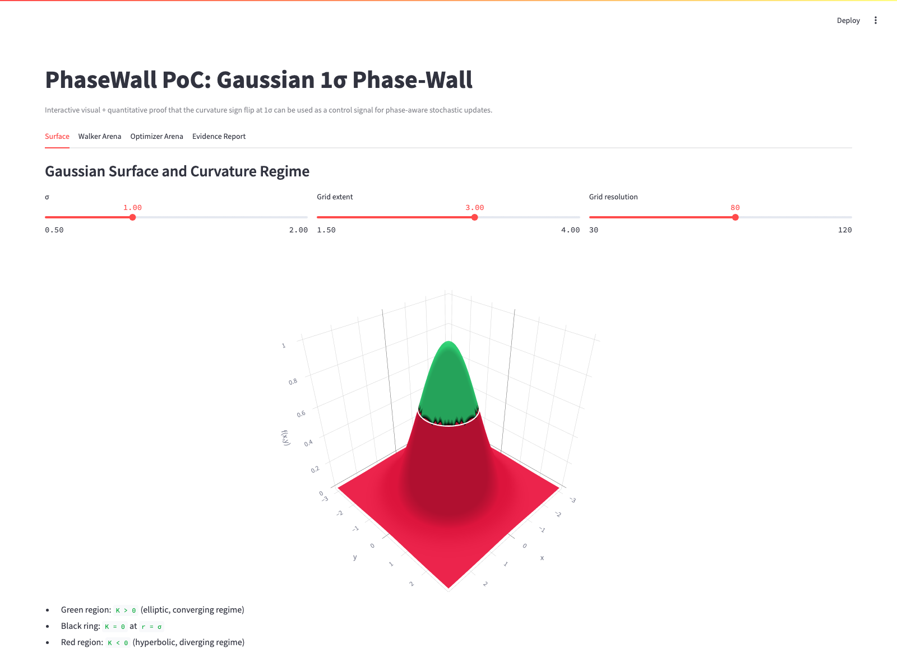
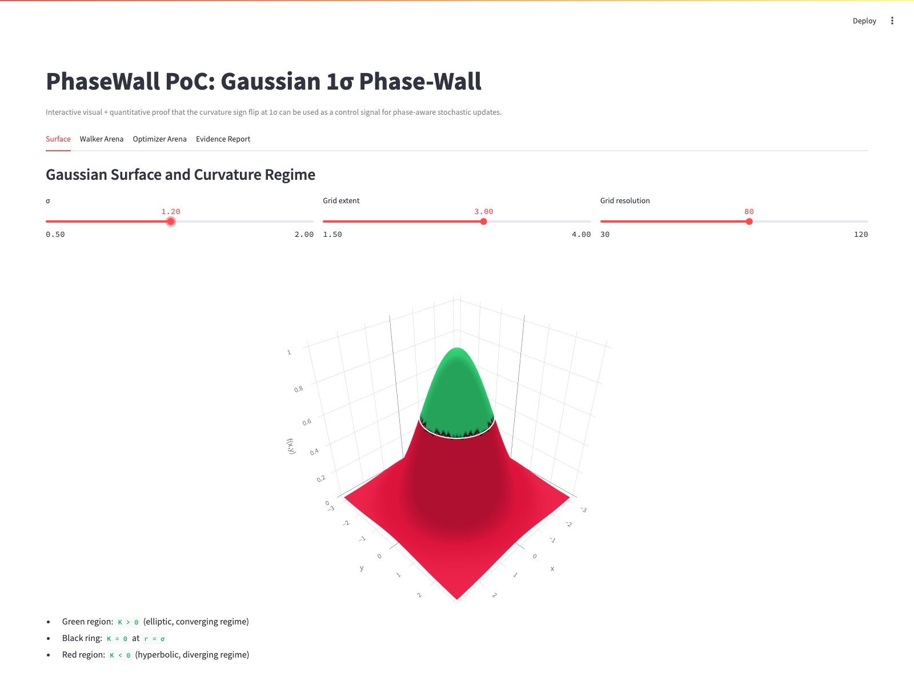
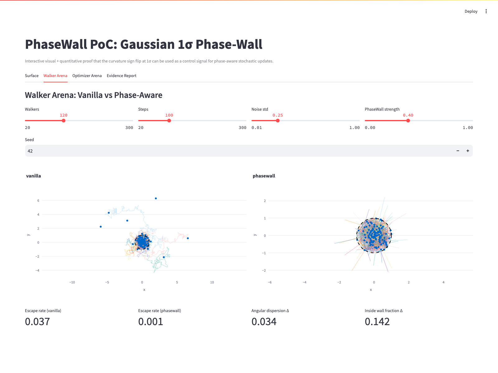
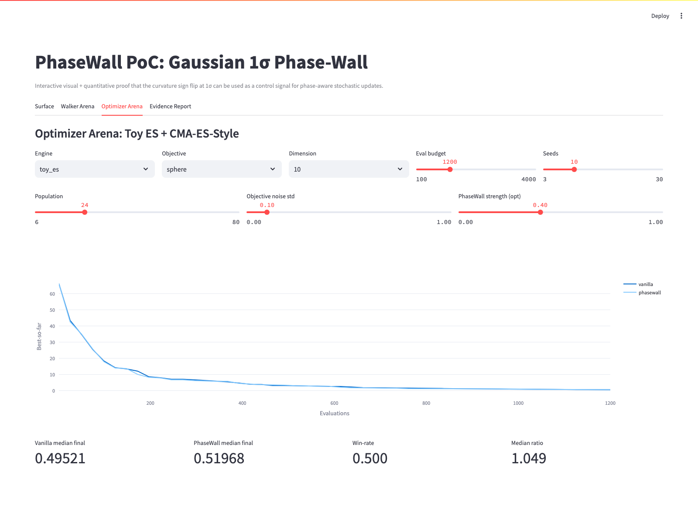
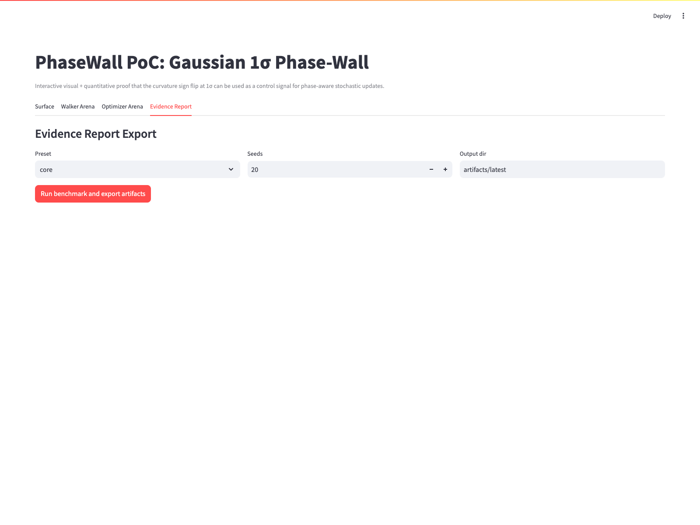
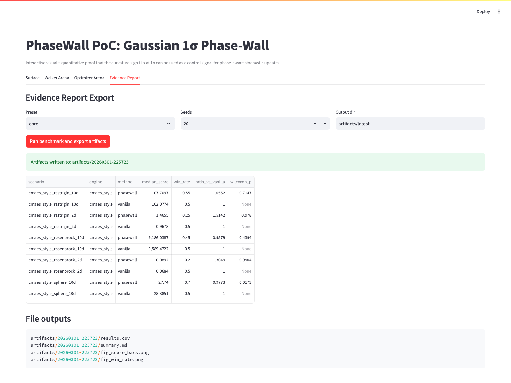

# PhaseWall PoC User Guide

## Purpose
This guide walks through every part of the PhaseWall PoC web UI, including the four tabs and the benchmark export workflow.

## Audience
Use this guide if you want to:
- Understand what each tab demonstrates.
- Reproduce the key phase-wall behavior.
- Run and export benchmark artifacts.

## Prerequisites and Startup
```bash
cd /Users/velocityworks/IdeaProjects/research/phasewall-poc-app
python -m venv .venv
source .venv/bin/activate
pip install -e .[dev]
streamlit run app.py
```

Open `http://localhost:8501`.

## UI Tour

### App Shell
The landing view shows the app title, explanatory caption, and all four tabs.



### Surface Tab
#### Baseline state
This tab visualizes the Gaussian hill, curvature sign coloring, and the `1σ` ring.


#### Control interaction state
Adjust `σ` (or other sliders) to see geometry and regime boundaries update.



### Walker Arena Tab
#### Baseline state
Set number of walkers, steps, noise, phase-wall strength, and random seed.



#### Result charts
Compare vanilla and phase-aware trajectories against the dashed unit ring.


#### Metrics row
Review escape rate and delta metrics to quantify behavior changes.


### Optimizer Arena Tab
#### Baseline control panel
Select engine/objective/dimension and tune budget, seeds, population, and noise.


#### Optimization curve
Compare best-so-far median trajectories for vanilla vs phase-aware methods.


#### Summary metrics
Check median final values, win rate, and median ratio.



### Evidence Report Tab
#### Pre-run state
Choose preset, seed count (default `20`), and output directory.



#### Post-run state
After pressing **Run benchmark and export artifacts**, verify success message, summary table, and output files.



## Run and Export Evidence
1. Open **Evidence Report**.
2. Keep `Preset=core` and `Seeds=20` (default).
3. Set output directory (default `artifacts/latest`).
4. Click **Run benchmark and export artifacts**.
5. Confirm generated files:
   - `results.csv`
   - `summary.md`
   - `fig_score_bars.png`
   - `fig_win_rate.png`

## Regenerating Screenshots
Use the automated capture flow:

```bash
cd /Users/velocityworks/IdeaProjects/research/phasewall-poc-app
source .venv/bin/activate
python -m playwright install chromium
python scripts/capture_ui_screenshots.py --start-streamlit --url http://localhost:8501 --out docs/screenshots --headless true --timeout-seconds 600
```

Optional: if Streamlit is already running, omit `--start-streamlit`.

## Troubleshooting
- App does not load: verify `streamlit run app.py` is running and `http://localhost:8501` is reachable.
- Playwright browser errors: run `python -m playwright install chromium`.
- Evidence run is slow: keep default settings and increase `--timeout-seconds`.
- Missing screenshots: rerun the script and check `docs/screenshots/` for the expected `01`-`11` PNG files.
