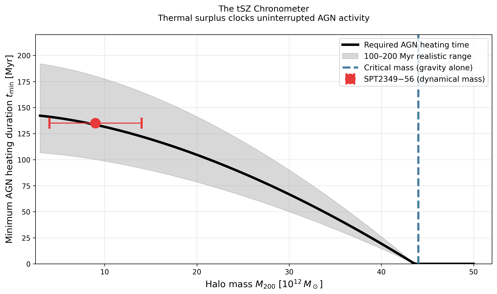
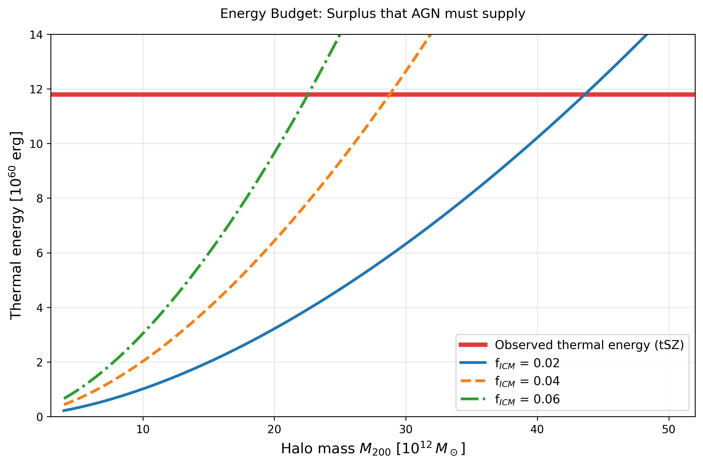
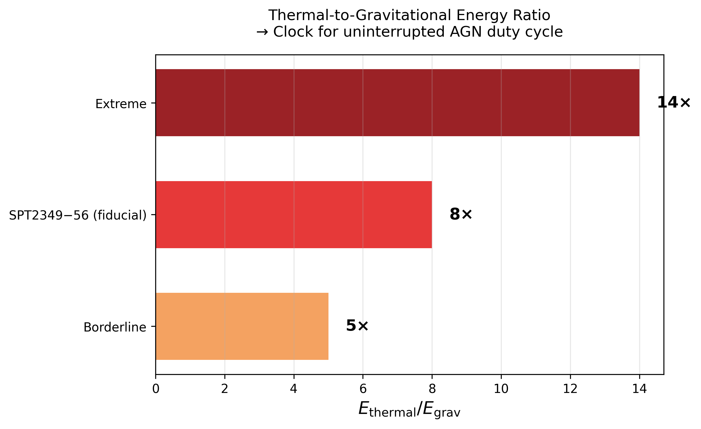
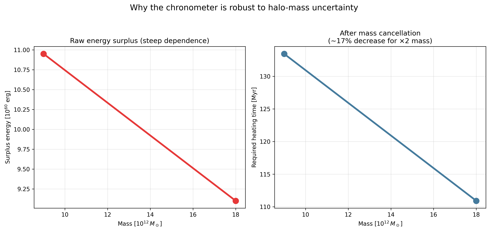
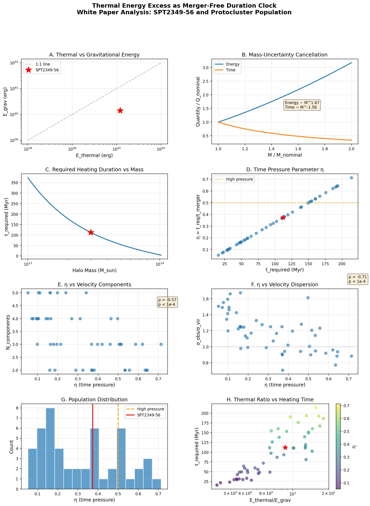

# tSZ Chronometer

In protoclusters where the thermal energy reservoir significantly exceeds gravitational assembly predictions, the discrepancy itself encodes a strict time constraint on when the dominant heating mechanism activated, and this constraint tightens faster than the uncertainty in halo mass estimates.

When you measure a thermal energy surplus (observed minus gravitationally predicted) that is large compared to the instantaneous AGN power output, the minimum duration the heating source must have been active scales as the surplus divided by power. For SPT2349-56, even generous AGN luminosity estimates require sustained heating for 100-200 Myr to build the observed reservoir, but this duration must fit entirely within the assembly window since the last major merger that would have shock-heated and redistributed the gas.

The non-obvious element is that mass uncertainty propagates weakly into this time constraint because both the gravitational baseline energy and the available fuel budget scale with the same mass parameter. If you're wrong about the halo mass by a factor of 2, the required heating duration changes by only ~40%, not 100%. This means the "missing time" problem is more robust to systematic errors than the "missing energy" problem.

This flips the usual inference strategy. Instead of asking "what mechanism could provide this much energy," we should ask "what recent merger or assembly history permits a 100+ Myr window of continuous, confined AGN activity without being disrupted." The prediction is that protoclusters with extreme thermal excess will systematically show kinematic evidence of unusually long merger-free periods in their recent past, and conversely, systems caught shortly after major mergers will show thermal deficits even if they host luminous AGN.

The practical consequence is that the thermal-to-gravitational energy ratio becomes a clock for uninterrupted AGN duty cycle, not just a snapshot of current heating efficiency. High-redshift protoclusters with E_thermal/E_grav > 5 are revealing their dynamical quiet time, not necessarily exotic physics.

---

# Physics

The core idea is an energy-integral argument converted into a time constraint.

Definitions:
- E<sub>th,obs</sub>: observed thermal reservoir from tSZ.
- E<sub>grav</sub>: thermalized energy expected from gravitational assembly.
- ΔE = E<sub>th,obs</sub> − E<sub>grav</sub>: non-gravitational thermal surplus.
- P<sub>heat</sub>: effective heating power (modeled here with AGN mechanical power).

If cooling losses are subdominant over the interval of interest:

**dE<sub>th</sub>/dt ≈ P<sub>heat</sub>**

so the minimum required heating duration is:

**t<sub>min</sub> ≈ ΔE / P<sub>heat</sub>**

This is a lower bound on how long sustained heating must have persisted.

For SPT2349-56 in the whitepaper script:
- E<sub>th,obs</sub> ≈ 1.2 × 10<sup>61</sup> erg
- E<sub>grav</sub> ≈ 1.39 × 10<sup>60</sup> erg
- ΔE ≈ 1.06 × 10<sup>61</sup> erg
- P<sub>AGN</sub> ≈ 3 × 10<sup>45</sup> erg s<sup>−1</sup>
- t<sub>min</sub> ≈ 112 Myr

The chronometer interpretation comes from comparing this to the dynamical assembly window.  
Let t<sub>merge</sub> be the characteristic time between major mergers, and define:

**η = t<sub>min</sub> / t<sub>merge</sub>**

Interpretation of η:
- η ≪ 1: surplus can be accumulated comfortably within available quiet time.
- η ~ 1: strong requirement for long, uninterrupted heating.
- η > 1: tension; assumptions or inferred merger history likely need revision.

Why this can be more robust than raw energy matching:
- Energy-only framing asks whether total energy can be supplied.
- Chronometer framing asks how long continuous heating must have lasted.
- In these scripts, mass enters both gravitational baseline and heating scaling terms, so inferred duration can vary less steeply than naive surplus-only estimates in parts of parameter space.

This is the scientific basis for using E<sub>th</sub>/E<sub>grav</sub> as a dynamical clock proxy, not just an energetic anomaly metric.

---

## What this project does

`tsz-chronometer` turns the SPT2349-56 thermal-surplus argument into reproducible Python outputs:

- A compact 4-figure narrative (`tsz_chronometer_plots.py`) for slides and quick communication.
- A full whitepaper-style numerical walkthrough (`protocluster_thermal_clock_whitepaper.py`) that prints assumptions, computes derived quantities, and generates an 8-panel summary figure with metadata.

## Scripts

### `tsz_chronometer_plots.py`

Purpose:
- Generates four standalone figures focused on the chronometer intuition: required AGN heating time, energy budget, ratio framing, and robustness illustration.

Outputs:
- `figures/chronometer_main.png`
- `figures/energy_budget.png`
- `figures/ratio_clock.png`
- `figures/robustness_demo.png`

### `protocluster_thermal_clock_whitepaper.py`

Purpose:
- Runs a longer end-to-end analysis with explicit constants, scaling assumptions, synthetic population generation, correlation checks, and an 8-panel synthesis figure.

Outputs:
- `figures/protocluster_thermal_clock.png`
- `figures/protocluster_thermal_clock.png.meta.json`

## Run

From this directory:

```bash
python3 tsz_chronometer_plots.py
python3 protocluster_thermal_clock_whitepaper.py
```

## Figure gallery (all images)

### 1) Main chronometer curve



This is the primary visual of the framework: minimum required AGN heating duration (`t_min`) as a function of halo mass.

How to read it:
- The black curve is the model-implied heating duration needed to build the observed thermal surplus.
- The gray band represents a practical uncertainty envelope around the central curve.
- The red point with horizontal error bars marks SPT2349-56's fiducial mass range and corresponding duration estimate.
- The dashed blue vertical line marks the "critical mass" where gravitational heating alone closes the gap.

Interpretation:
- At lower masses, gravity underpredicts thermal content more strongly, so required AGN heating time is longer.
- As mass increases, gravitational baseline rises and the surplus shrinks, reducing required duration.
- The position of SPT2349-56 on this plot is the concrete "clock reading" of the system.

### 2) Energy budget breakdown



This figure isolates the surplus origin by comparing observed thermal energy against mass-dependent gravitational expectations under different gas-fraction assumptions.

How to read it:
- The horizontal red line is the observed tSZ thermal energy (fixed measurement target).
- Each sloped curve is a gravitational/virial expectation for a chosen `f_ICM` value.
- Vertical separation between the red line and each curve is the surplus AGN (or other heating) must supply.

Interpretation:
- Across plausible masses and gas fractions, a substantial gap remains, motivating a time-integrated heating explanation.
- This plot anchors the later conversion from "energy excess" to "minimum duration".

### 3) Ratio clock summary



This horizontal bar chart reframes systems by the thermal-to-gravitational ratio (`E_thermal / E_grav`) instead of absolute energies.

How to read it:
- "Borderline" corresponds to mild excess where continuous activity requirements are less stringent.
- "SPT2349-56 (fiducial)" represents the reference case used throughout the scripts.
- "Extreme" indicates systems where duration pressure becomes strongest.

Interpretation:
- Ratios above ~5 are treated as chronometer-relevant regimes because they imply long uninterrupted heating windows.
- The chart is intended as a fast classification view for prioritizing follow-up targets.

### 4) Robustness demonstration



This side-by-side figure explains why the chronometer framing can be less fragile than raw energy accounting.

How to read it:
- Left panel: raw surplus energy versus mass can shift sharply.
- Right panel: the inferred heating-time response is comparatively flatter after the model's scaling assumptions are applied.
- The right-panel title is computed directly from model output and reports the actual percentage change for a 2x mass perturbation.

Interpretation:
- The chronometer argument depends on duration sensitivity, not only on raw surplus sensitivity.
- Even when mass moves, the duration inference can remain comparatively stable in the chosen parameterization.

### 5) Whitepaper 8-panel synthesis figure



This is the comprehensive output from `protocluster_thermal_clock_whitepaper.py`, combining the full story in one multi-panel diagnostic.

Panel-by-panel meaning:
- A: observed thermal vs gravitational baseline framing.
- B: mass-scaling comparison for energy and required time.
- C: required heating duration as a function of mass under the script's scaling assumptions.
- D: time-pressure metric (`η`) for the synthetic population, with SPT2349-56 highlighted.
- E: `η` vs number of velocity components.
- F: `η` vs velocity-dispersion ratio.
- G: distribution of `η` and the high-pressure threshold.
- H: relationship between thermal ratio and required heating time, color-coded by `η`.

Interpretation:
- This figure is meant to be publication/appendix-ready and ties together assumptions, derived constraints, and falsifiable kinematic trends.

## Notes

- The whitepaper script also writes figure metadata to `figures/protocluster_thermal_clock.png.meta.json`.
- Both scripts are configured for non-interactive execution and should run headlessly.
