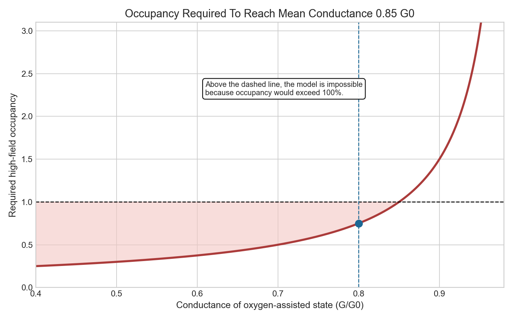
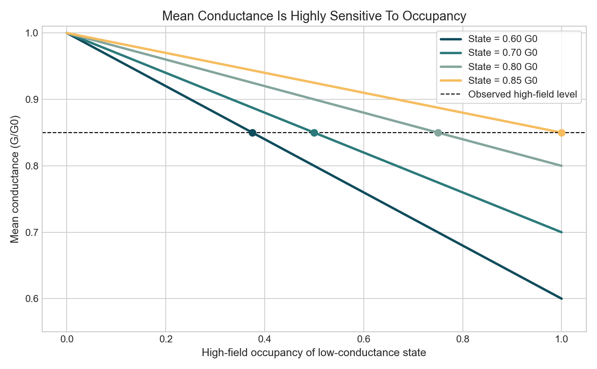
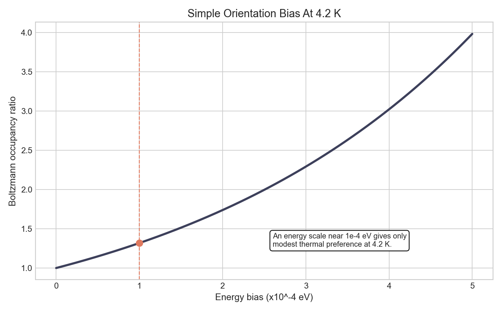
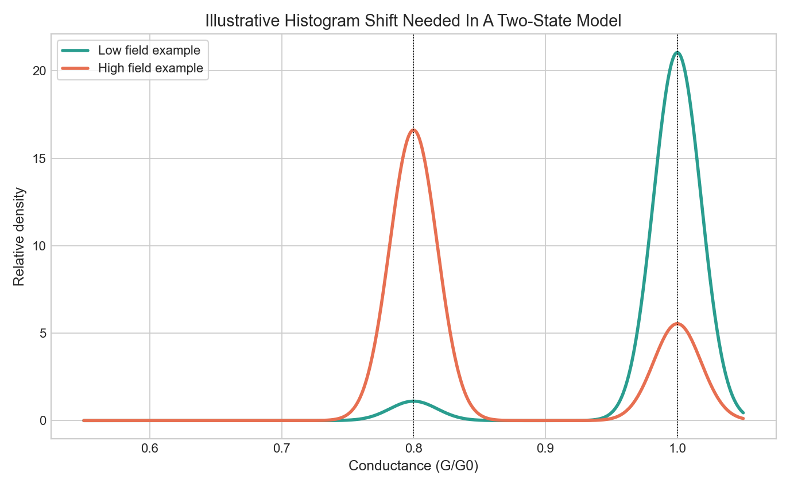

# Unexpected Magnetic Response

This folder is now a self-contained laptop-scale reanalysis project for:

`Conductance of atomic size contacts of Ag and Au at high magnetic fields`

Source paper: [cmh2-frmf.pdf](./cmh2-frmf.pdf)

## Project Goal

Test whether the paper's proposed oxygen-mediated mechanism is quantitatively plausible without new lab data.

The project focuses on one question:

`Can field-driven reweighting of oxygen-bearing junction states plausibly explain the reported ~15% drop in Au single-contact conductance at 20 T?`

## What This Project Contains

- [data/paper_observations.csv](./data/paper_observations.csv)
  Structured observations extracted from the paper and used in the analysis.
- [data/mechanism_audit.csv](./data/mechanism_audit.csv)
  Claim-by-claim evidence audit of the proposed mechanism.
- [scripts/analyze.py](./scripts/analyze.py)
  Reproducible analysis script that generates figures and a metrics file.
- [notes/research_note.md](./notes/research_note.md)
  Compact write-up of the reanalysis logic and conclusions.
- [outputs/figures](./outputs/figures)
  Generated visualizations.
- [outputs/summary_metrics.json](./outputs/summary_metrics.json)
  Machine-readable results from the model.

## Core Idea

The paper's mechanism is not just "oxygen lowers conductance."

It is stronger and more specific:

`the magnetic field must change the population of junction states`

That distinction matters. If the oxygen-bearing state has conductance near `0.8 G0`, then a 15% mean drop in the measured contact conductance requires a very large increase in the fraction of those states at high field. This project quantifies that requirement.

## Main Analytical Result

Under a minimal two-state model:

- clean state conductance: `1.0 G0`
- oxygen-assisted state conductance: `0.8 G0`
- observed mean high-field conductance: `0.85 G0`

the required high-field occupancy of the low-conductance state is:

`p = (1.0 - 0.85) / (1.0 - 0.8) = 0.75`

That means a `75%` occupancy of the oxygen-assisted state if the zero-field baseline is clean. This is far larger than the intuitive story of a rare impurity configuration becoming modestly more common.

The project therefore argues:

`the oxygen mechanism is viable only if the field strongly reweights junction-state populations, not if it merely perturbs a fixed junction`

## Run

From the project root:

```bash
MPLCONFIGDIR="$PWD/.mplconfig" python3 unexpected-magnetic-response/scripts/analyze.py
```

## Outputs

The script generates:

- `occupancy_required_vs_state_conductance.png`
- `mean_conductance_vs_occupancy.png`
- `orientation_bias_vs_energy.png`
- `example_histograms.png`
- `summary_metrics.json`

## Figures

### 1. Required Occupancy Versus State Conductance



This plot asks a direct question:

`if the observed high-field mean is 0.85 G0, how common does the low-conductance state need to be?`

The x-axis is the conductance of the oxygen-assisted state. The y-axis is the required occupancy of that state at high field.

What it shows:

- If the oxygen-assisted state is close to `0.8 G0`, the required occupancy is `0.75`.
- If the state is any higher than `0.85 G0`, the model becomes impossible because occupancy would need to exceed `100%`.
- The curve is steep near `0.85 G0`, so modest changes in the assumed oxygen-state conductance have large consequences for plausibility.

What it means:

This is the main feasibility plot for the project. It shows that the oxygen mechanism works only if the field creates a large population shift, not a mild perturbation.

### 2. Mean Conductance Versus Occupancy



This plot flips the same question around:

`for a given low-conductance state, how quickly does the mean conductance fall as that state becomes more common?`

Each line assumes a different conductance for the low-conductance state.

What it shows:

- For a `0.8 G0` state, you only reach `0.85 G0` once occupancy rises to about `75%`.
- For a more severe `0.7 G0` state, `50%` occupancy is enough.
- For a mild `0.85 G0` state, the whole high-field population would need to be in that state.

What it means:

The paper's mechanism is very sensitive to how deep the oxygen-assisted conductance suppression really is. If the relevant state is not far below `1.0 G0`, the required occupancy shift becomes extreme.

### 3. Orientation Bias Versus Energy



This plot checks whether the reported magnetic anisotropy energy scale is large enough to strongly favor one oxygen orientation at `4.2 K`.

The x-axis is an assumed energy preference in units of `10^-4 eV`. The y-axis is the corresponding Boltzmann occupancy ratio.

What it shows:

- At the paper's reported order-of-magnitude energy scale of `1e-4 eV`, the simple thermal bias is only about `1.32x`.
- That is a real preference, but not a dominant one.
- Much larger energetic bias would be needed to make orientation selection alone overwhelming.

What it means:

A small anisotropy energy can help, but by itself it does not look sufficient to transform a rare oxygen configuration into the dominant transport state. That pushes the mechanism toward broader junction-state reweighting.

### 4. Illustrative Histogram Shift



This is a toy example of what the conductance distribution would need to look like in a simple two-state model.

The low-field example is mostly a clean state near `1.0 G0`. The high-field example assumes the low-conductance `0.8 G0` state becomes much more common.

What it shows:

- A large change in the mixture weights can pull the overall distribution downward.
- The shift is not produced by tiny contamination fractions.
- To get a large mean shift with a `0.8 G0` oxygen state, the low-conductance population has to become visually prominent.

What it means:

This makes the central argument concrete. The model is not saying "oxygen exists." It is saying the histogram must reflect a strong redistribution of junction states if oxygen is the main driver.

## Scope And Limits

- No experimental raw traces were available in this folder.
- The model uses quantities stated or implied in the paper plus transparent simplifying assumptions.
- The aim is not to disprove the published mechanism, but to identify what must be true for it to work quantitatively.
